# TCP可靠传输实现

## TCP可靠传输概述

TCP（传输控制协议）是一种面向连接的、可靠的、基于字节流的传输层通信协议。TCP通过多种机制确保数据可靠传输，包括序列号、确认应答、超时重传、流量控制和拥塞控制等。

### TCP可靠传输的核心特性

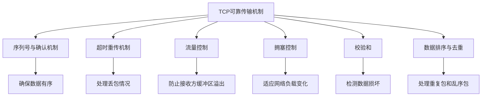

## 序列号与确认机制

TCP使用序列号和确认号来跟踪已发送和已接收的数据字节。

### 序列号与确认号工作原理

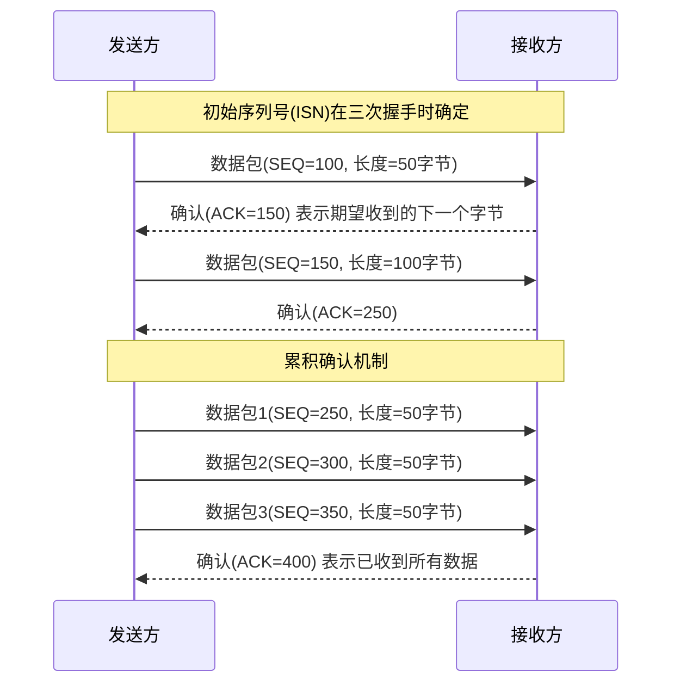

### 选择性确认(SACK)

选择性确认允许接收方确认不连续的数据块，提高重传效率。

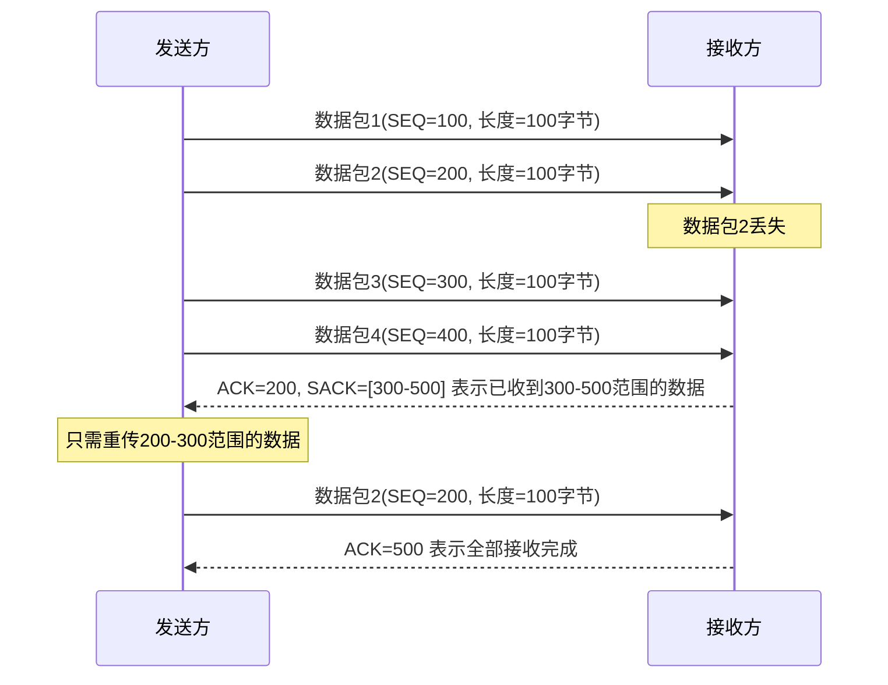

## 超时重传机制

超时重传是TCP处理丢包的基本机制，当发送方在一定时间内没有收到确认，就会重传数据。

### 超时计算

TCP使用自适应算法计算重传超时时间(RTO)，基于往返时间(RTT)的测量。

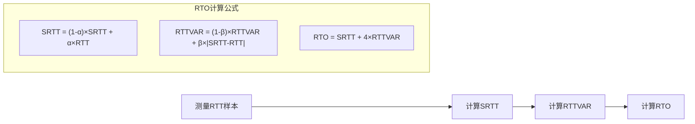

### 快速重传

快速重传是对基本超时重传的改进，不等待超时，而是根据重复ACK触发重传。

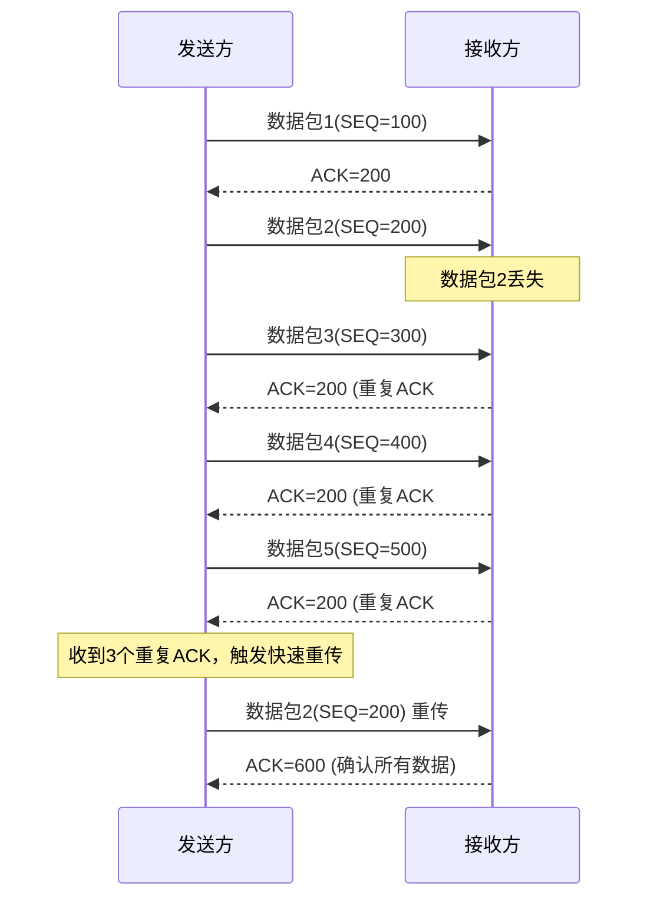

## 流量控制

流量控制通过滑动窗口机制防止发送方发送速度过快导致接收方缓冲区溢出。

### 滑动窗口机制

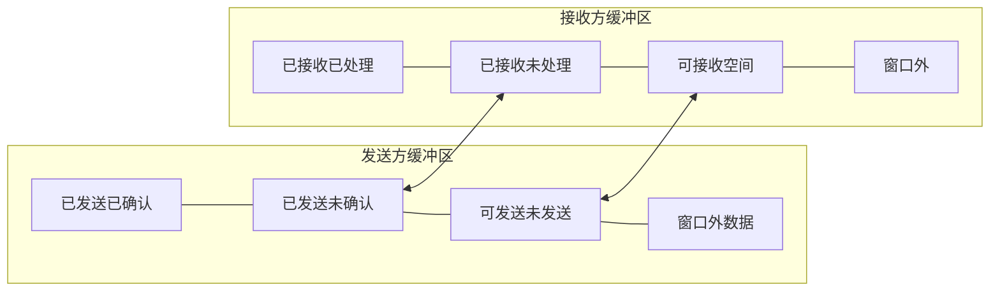

### 窗口更新过程

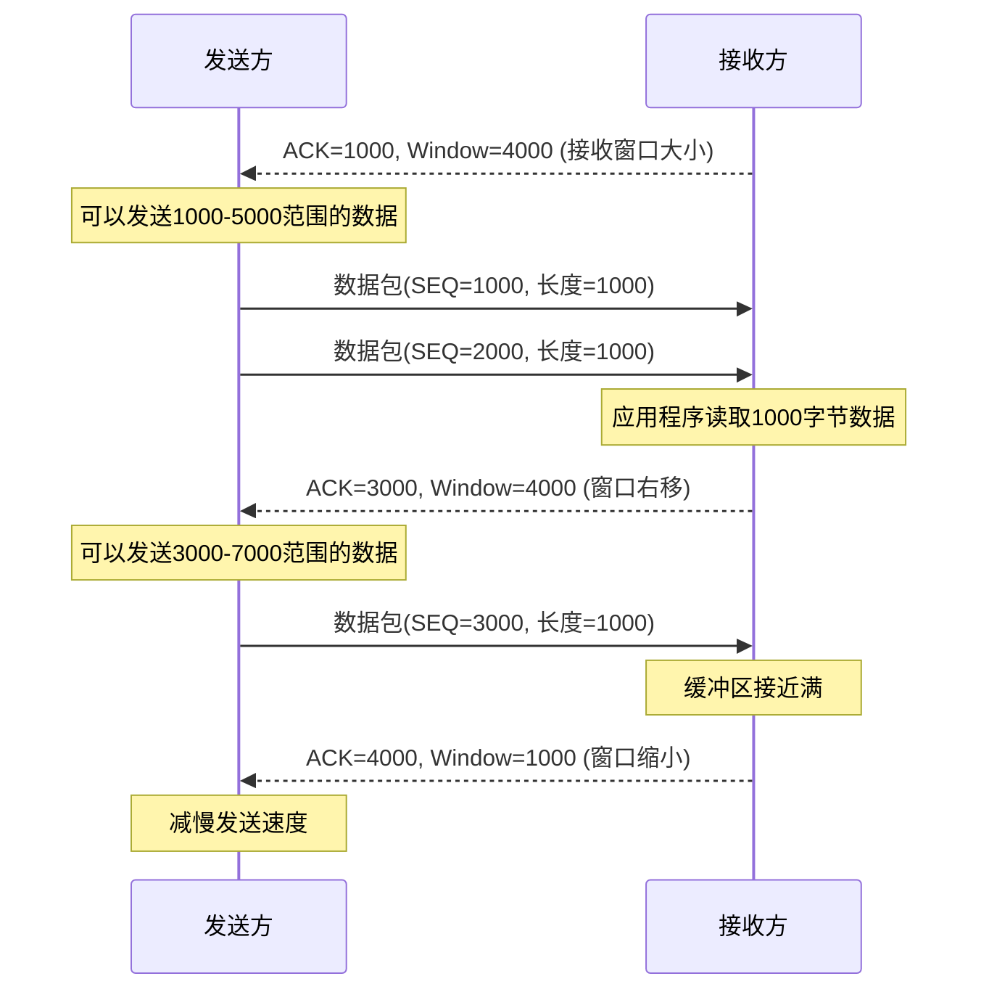

### 零窗口与窗口探测

当接收方的接收窗口变为0时，发送方会暂停发送数据，并定期发送窗口探测包。

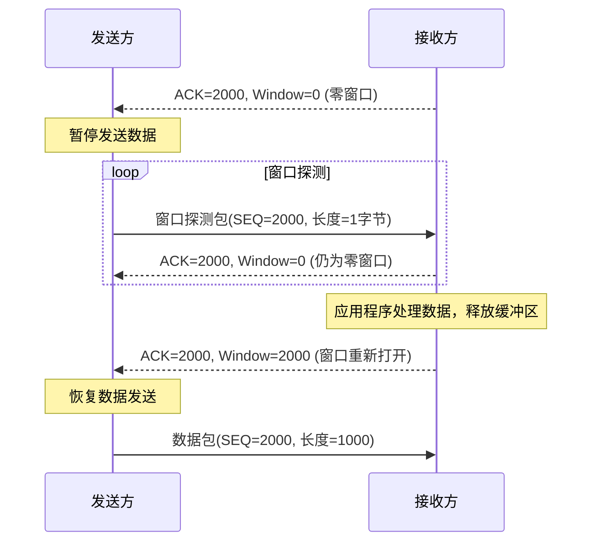

## 拥塞控制

拥塞控制是TCP适应网络负载变化的机制，通过调整发送速率避免网络拥塞。

### 拥塞控制算法

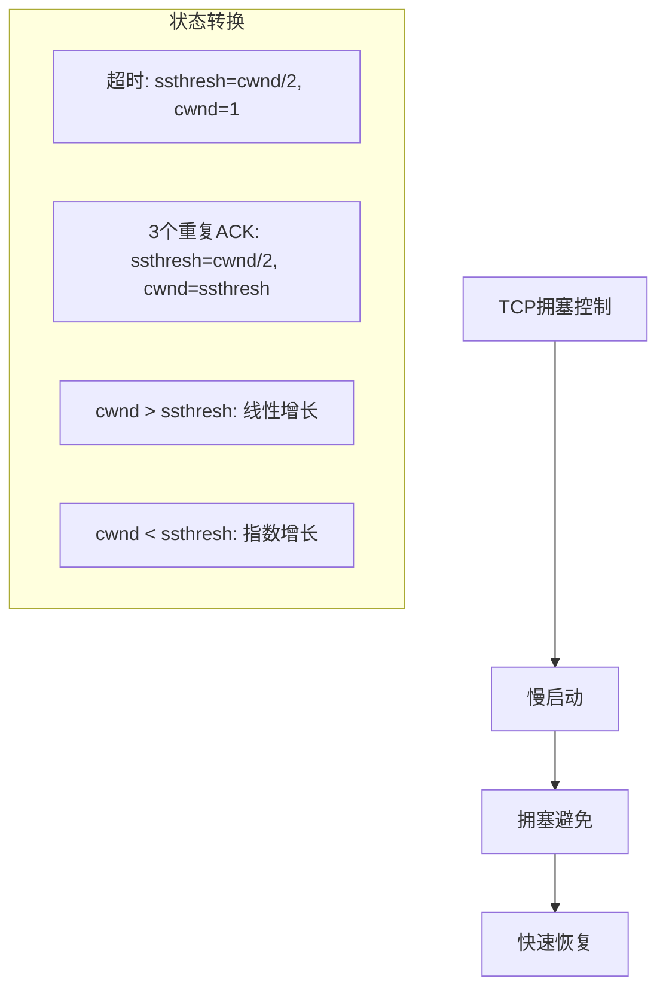

### 拥塞窗口变化

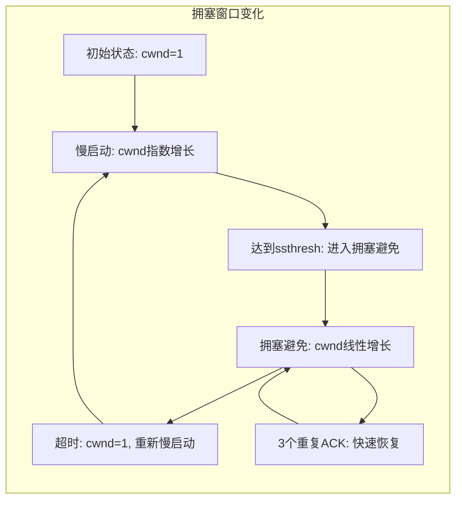

### 不同拥塞控制算法比较

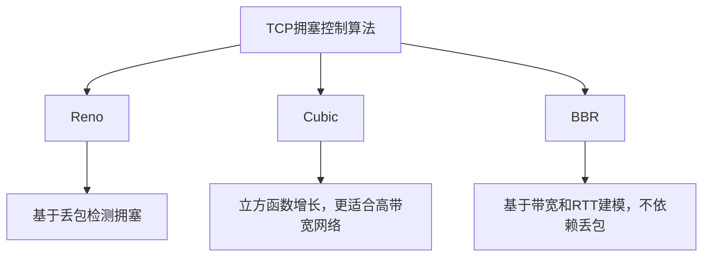

## 校验和与数据完整性

TCP使用校验和来检测数据在传输过程中是否被损坏。

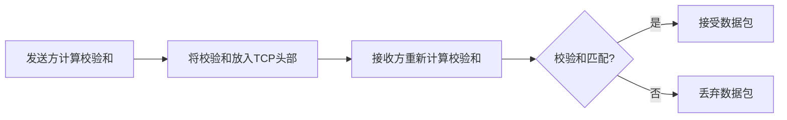

## TCP性能优化技术

### 延迟确认

接收方不立即发送确认，而是等待一段时间，可能与回程数据一起发送，减少网络开销。

### Nagle算法

合并小数据包再发送，减少网络中的小包数量，提高带宽利用率。

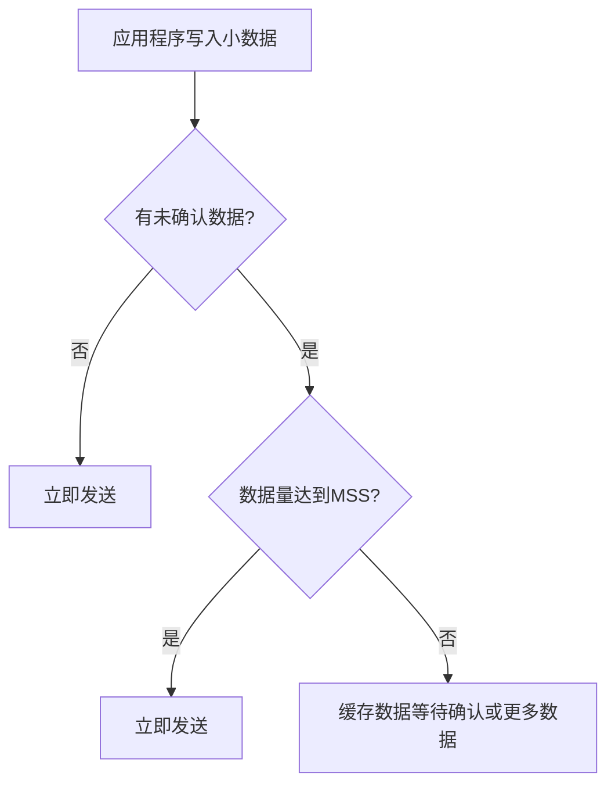

### 时间戳选项

通过在TCP头部添加时间戳，提高RTT估计的准确性，改进超时重传机制。

## TCP可靠传输的挑战与解决方案

### 高延迟网络

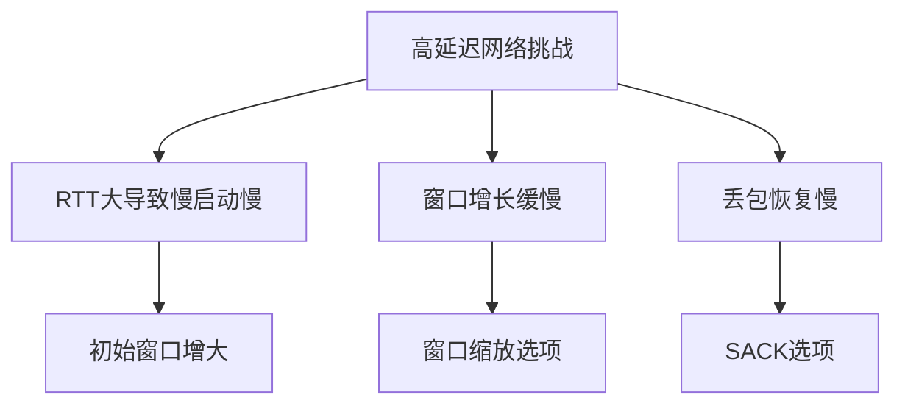

### 无线网络

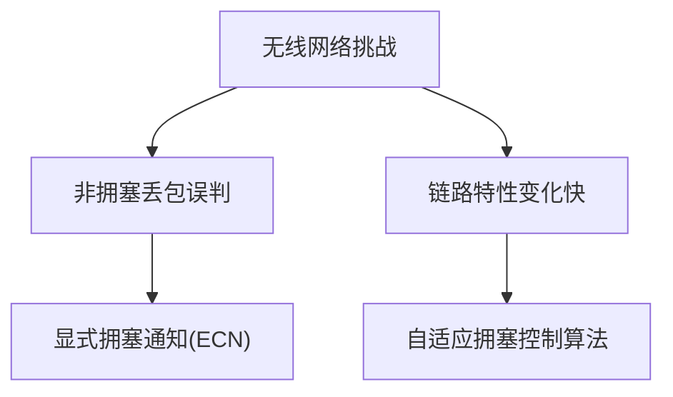

## 总结

TCP通过多种机制共同作用，实