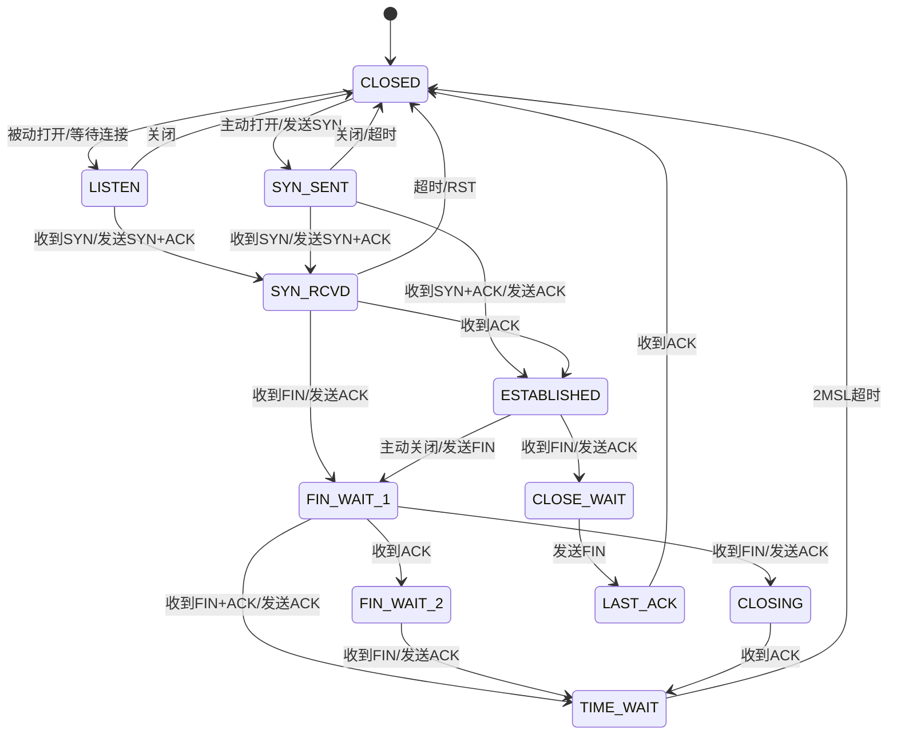
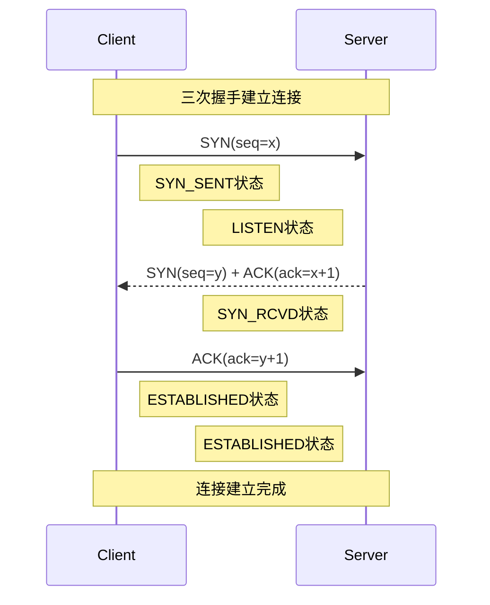
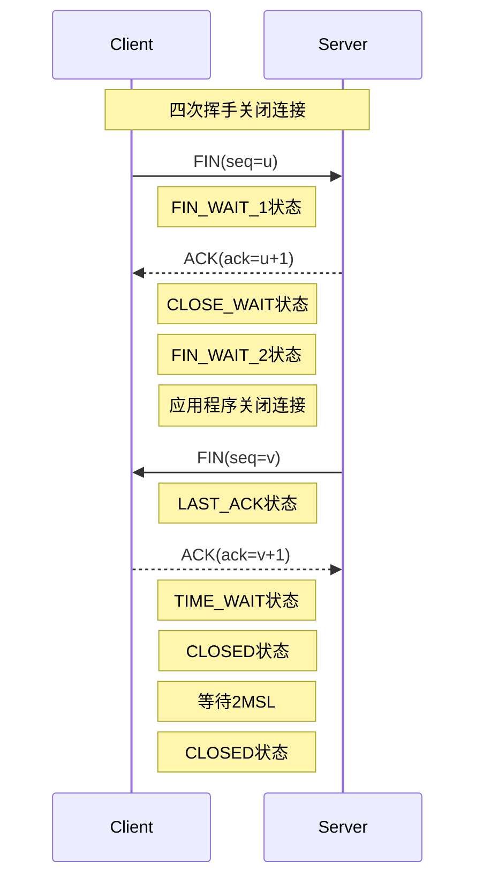
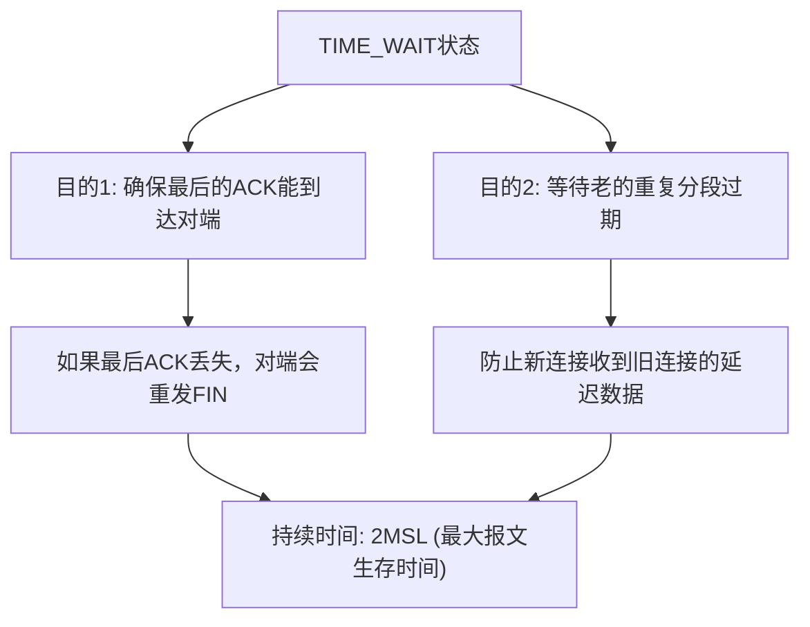
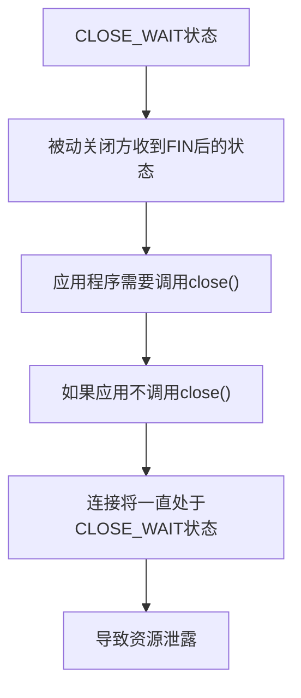
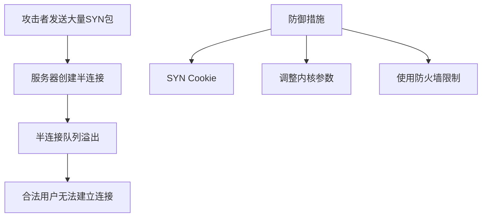
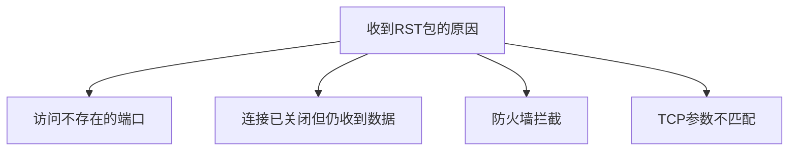

# TCP状态机理解

## TCP状态机概述

TCP（传输控制协议）是一种面向连接的、可靠的、基于字节流的传输层通信协议。TCP通过状态机来管理连接的生命周期，包括建立连接、数据传输和连接终止等阶段。

### TCP连接的特点

1. **面向连接**：通信前需要建立连接，通信后需要释放连接
2. **可靠传输**：使用序列号、确认应答、重传等机制保证数据可靠传输
3. **流量控制**：通过滑动窗口机制控制发送速率
4. **拥塞控制**：通过拥塞窗口动态调整网络负载

## TCP状态转换图



## TCP三次握手

三次握手是TCP建立连接的过程，确保双方都具备收发数据的能力。



### 三次握手的目的

1. **第一次握手**：客户端发送SYN，告知服务器自己的初始序列号
2. **第二次握手**：服务器回复SYN+ACK，确认客户端的序列号并告知自己的初始序列号
3. **第三次握手**：客户端回复ACK，确认服务器的序列号

### 为什么需要三次握手

主要是为了防止已失效的连接请求报文段突然又传送到服务端，因而产生错误。如果只有两次握手，服务器无法确认客户端的接收能力。

## TCP四次挥手

四次挥手是TCP终止连接的过程，确保双方都完成数据传输并同意关闭连接。



### 四次挥手的目的

1. **第一次挥手**：客户端发送FIN，表示不再发送数据
2. **第二次挥手**：服务器回复ACK，确认收到客户端的FIN
3. **第三次挥手**：服务器发送FIN，表示服务器也不再发送数据
4. **第四次挥手**：客户端回复ACK，确认收到服务器的FIN

### 为什么需要四次挥手

因为TCP是全双工通信，每个方向的连接关闭是独立的。当一方发送FIN时，只是表示这一方不再发送数据，但仍可以接收数据，所以需要四次挥手来分别关闭两个方向的连接。

## TIME_WAIT状态

TIME_WAIT是TCP连接关闭过程中的一个重要状态，主动关闭连接的一方在收到对方的FIN并回复ACK后进入该状态。



### TIME_WAIT的重要性

1. **确保可靠关闭**：如果最后一个ACK丢失，对端会重发FIN，此时如果没有TIME_WAIT状态，将无法正确处理
2. **防止延迟报文干扰**：确保所有属于旧连接的报文在网络中消失，避免影响新建立的相同五元组连接

### TIME_WAIT问题及优化

1. **资源占用**：每个TIME_WAIT连接会占用系统资源
2. **端口耗尽**：大量TIME_WAIT可能导致端口资源耗尽

优化方法：
```bash
# 允许TIME_WAIT套接字用于新的TCP连接
sysctl -w net.ipv4.tcp_tw_reuse=1

# 快速回收TIME_WAIT套接字（不推荐在生产环境使用）
sysctl -w net.ipv4.tcp_tw_recycle=1

# 设置TIME_WAIT超时时间
sysctl -w net.ipv4.tcp_fin_timeout=30
```

## CLOSE_WAIT状态

CLOSE_WAIT是被动关闭方收到FIN后进入的状态，表示对方已经关闭连接，但本地应用程序还未关闭。



### CLOSE_WAIT堆积问题

大量CLOSE_WAIT状态通常表明应用程序存在bug，没有正确关闭连接。常见原因：

1. **应用程序逻辑错误**：没有调用close()或shutdown()
2. **应用程序死锁**：无法执行到关闭连接的代码
3. **资源耗尽**：系统资源不足，无法处理关闭操作

### 解决CLOSE_WAIT问题

1. **代码审查**：确保应用程序在收到FIN后正确关闭连接
2. **超时机制**：实现连接超时检测，强制关闭长时间处于CLOSE_WAIT的连接
3. **监控告警**：监控CLOSE_WAIT数量，超过阈值时告警

## TCP状态监控命令

```bash
# 查看所有TCP连接状态统计
netstat -n | awk '/^tcp/ {++state[$NF]} END {for(key in state) print key,"\t",state[key]}'

# 查看TIME_WAIT连接数量
netstat -ant | grep TIME_WAIT | wc -l

# 查看CLOSE_WAIT连接数量
netstat -ant | grep CLOSE_WAIT | wc -l

# 使用ss命令查看详细连接信息（更高效）
ss -tan state time-wait
ss -tan state close-wait
```

## 常见TCP连接问题分析

### SYN Flood攻击



### 连接重置（RST）问题



## TCP状态机在编程中的应用

### 服务器端状态处理

```c
// 简化的TCP服务器状态处理
int main() {
    // 创建套接字
    int server_fd = socket(AF_INET, SOCK_STREAM, 0);
    // 绑定地址
    bind(server_fd, ...); 
    // 监听连接 - 进入LISTEN状态
    listen(server_fd, backlog);
    
    while(1) {
        // 接受连接 - 完成三次握手，进入ESTABLISHED状态
        int client_fd = accept(server_fd, ...);
        
        // 数据交换
        read(client_fd, ...);
        write(client_fd, ...);
        
        // 关闭连接 - 发起四次挥手
        close(client_fd);
    }
}
```

### 客户端状态处理

```c
// 简化的TCP客户端状态处理
int main() {
    // 创建套接字
    int sock_fd = socket(AF_INET, SOCK_STREAM, 0);
    
    // 连接服务器 - 发起三次握手，进入ESTABLISHED状态
    connect(sock_fd, ...);
    
    // 数据交换
    write(sock_fd, ...);
    read(sock_fd, ...);
    
    // 关闭连接 - 发起四次挥手
    close(sock_fd); // 进入FIN_WAIT_1状态
}
```