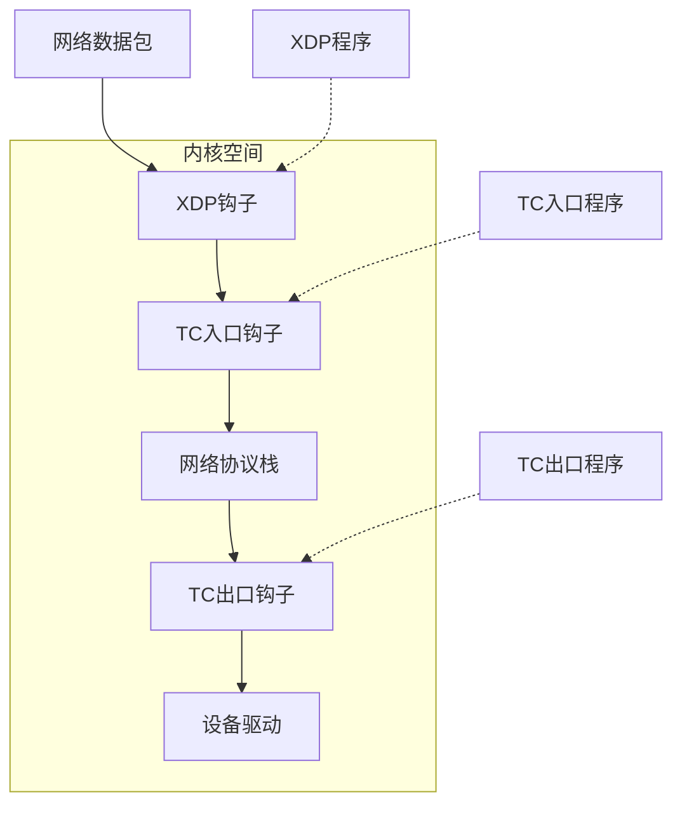
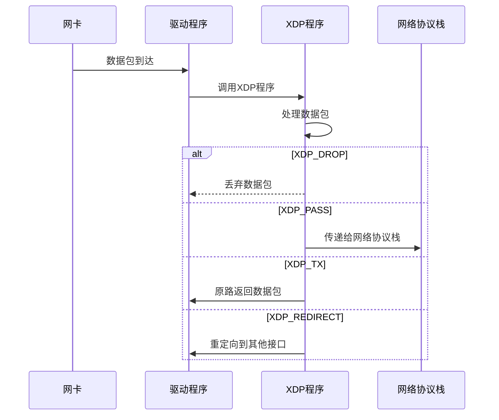
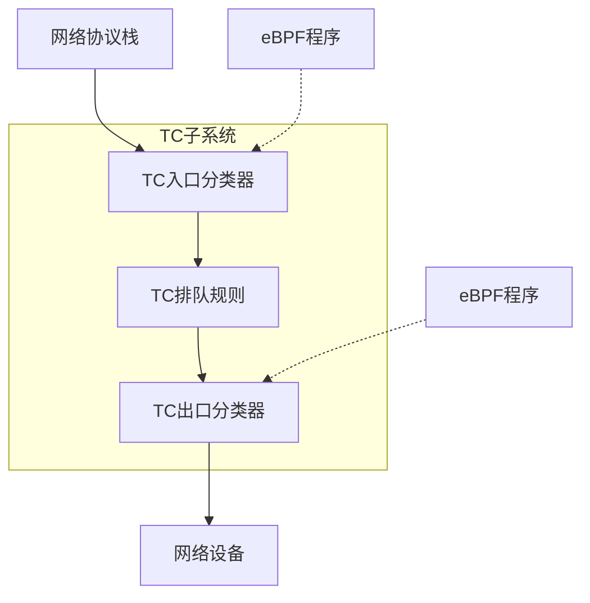

# eBPF 网络编程

## 概述

eBPF（扩展的伯克利包过滤器）为Linux网络编程提供了强大的能力，允许在内核中安全地执行用户定义的程序，而无需修改内核源代码或加载内核模块。本文详细介绍如何使用eBPF进行网络编程，特别是XDP（eXpress Data Path）和TC（Traffic Control）程序的开发。

## eBPF 网络编程架构



## XDP 编程

XDP（eXpress Data Path）允许在网络栈的最早期处理数据包，提供最高性能。

### 1. XDP 工作原理



### 2. XDP 程序类型

XDP程序有三种运行模式：

- **Native XDP**：在网卡驱动中运行，性能最高
- **Generic XDP**：对不支持Native XDP的网卡的兼容模式
- **Offloaded XDP**：卸载到支持的网卡硬件中执行

### 3. XDP 程序示例

#### 基本的XDP程序（丢弃特定IP的数据包）

```c
#include <linux/bpf.h>
#include <linux/if_ether.h>
#include <linux/ip.h>
#include <bpf/bpf_helpers.h>

SEC("xdp")
int xdp_filter_prog(struct xdp_md *ctx) {
    void *data_end = (void *)(long)ctx->data_end;
    void *data = (void *)(long)ctx->data;
    
    // 确保数据包至少包含以太网头部
    struct ethhdr *eth = data;
    if (data + sizeof(*eth) > data_end)
        return XDP_PASS;
    
    // 检查是否为IPv4数据包
    if (eth->h_proto != htons(ETH_P_IP))
        return XDP_PASS;
    
    // 解析IP头部
    struct iphdr *iph = data + sizeof(*eth);
    if ((void *)(iph + 1) > data_end)
        return XDP_PASS;
    
    // 检查源IP是否为要过滤的IP (192.168.1.100)
    if (iph->saddr == htonl(0xC0A80164))
        return XDP_DROP;
    
    return XDP_PASS;
}

char _license[] SEC("license") = "GPL";
```

#### 加载XDP程序

```c
#include <bpf/libbpf.h>
#include <bpf/bpf.h>
#include <net/if.h>

int main(int argc, char **argv) {
    if (argc != 2) {
        fprintf(stderr, "Usage: %s <ifname>\n", argv[0]);
        return 1;
    }
    
    // 加载BPF对象文件
    struct bpf_object *obj = bpf_object__open("xdp_filter.o");
    if (!obj) {
        fprintf(stderr, "Failed to open BPF object\n");
        return 1;
    }
    
    // 加载BPF程序
    if (bpf_object__load(obj)) {
        fprintf(stderr, "Failed to load BPF object\n");
        bpf_object__close(obj);
        return 1;
    }
    
    // 获取程序文件描述符
    struct bpf_program *prog = bpf_object__find_program_by_name(obj, "xdp_filter_prog");
    if (!prog) {
        fprintf(stderr, "Failed to find BPF program\n");
        bpf_object__close(obj);
        return 1;
    }
    int prog_fd = bpf_program__fd(prog);
    
    // 附加到网络接口
    unsigned int ifindex = if_nametoindex(argv[1]);
    if (bpf_set_link_xdp_fd(ifindex, prog_fd, 0) < 0) {
        fprintf(stderr, "Failed to attach XDP program\n");
        bpf_object__close(obj);
        return 1;
    }
    
    printf("XDP program attached to interface %s\n", argv[1]);
    
    // 保持程序运行
    while (1) {
        sleep(1);
    }
    
    return 0;
}
```

### 4. XDP Maps

XDP程序可以使用BPF Maps存储和检索数据：

```c
#include <linux/bpf.h>
#include <bpf/bpf_helpers.h>

// 定义一个哈希表，用于存储要过滤的IP地址
struct {
    __uint(type, BPF_MAP_TYPE_HASH);
    __uint(max_entries, 1024);
    __type(key, __u32);    // IP地址
    __type(value, __u8);   // 1表示过滤
} blacklist SEC(".maps");

SEC("xdp")
int xdp_filter_prog(struct xdp_md *ctx) {
    void *data_end = (void *)(long)ctx->data_end;
    void *data = (void *)(long)ctx->data;
    
    // 解析以太网和IP头部...
    struct ethhdr *eth = data;
    if (data + sizeof(*eth) > data_end)
        return XDP_PASS;
    
    if (eth->h_proto != htons(ETH_P_IP))
        return XDP_PASS;
    
    struct iphdr *iph = data + sizeof(*eth);
    if ((void *)(iph + 1) > data_end)
        return XDP_PASS;
    
    // 查询源IP是否在黑名单中
    __u32 src_ip = iph->saddr;
    __u8 *blocked = bpf_map_lookup_elem(&blacklist, &src_ip);
    
    if (blocked && *blocked == 1)
        return XDP_DROP;
    
    return XDP_PASS;
}

char _license[] SEC("license") = "GPL";
```

## TC 编程

TC（Traffic Control）是Linux内核中的流量控制子系统，eBPF程序可以附加到TC钩子点进行数据包处理。

### 1. TC 架构



### 2. TC vs XDP

| 特性 | TC | XDP |
|------|----|----- |
| 执行点 | 网络栈内部 | 驱动接收路径最早期 |
| 性能 | 中等 | 最高 |
| 功能 | 更丰富 | 基础功能 |
| 数据包修改 | 完全支持 | 有限支持 |
| 方向 | 入口和出口 | 主要是入口 |
| 兼容性 | 所有网卡 | 需要驱动支持 |

### 3. TC 程序示例

#### 基本的TC程序（数据包计数器）

```c
#include <linux/bpf.h>
#include <linux/pkt_cls.h>
#include <bpf/bpf_helpers.h>

// 定义一个数组，用于存储数据包计数
struct {
    __uint(type, BPF_MAP_TYPE_ARRAY);
    __uint(max_entries, 1);
    __type(key, __u32);
    __type(value, __u64);
} packet_count SEC(".maps");

SEC("tc")
int tc_counter(struct __sk_buff *skb) {
    // 更新数据包计数
    __u32 key = 0;
    __u64 *count = bpf_map_lookup_elem(&packet_count, &key);
    if (count) {
        (*count)++;
    }
    
    // 允许数据包通过
    return TC_ACT_OK;
}

char _license[] SEC("license") = "GPL";
```

#### 加载TC程序

```bash
# 编译BPF程序
clang -O2 -target bpf -c tc_counter.c -o tc_counter.o

# 创建TC队列规则
tc qdisc add dev eth0 clsact

# 加载BPF程序到TC入口
tc filter add dev eth0 ingress bpf direct-action obj tc_counter.o sec tc

# 查看统计信息
tc filter show dev eth0 ingress
```

### 4. TC 高级功能

#### 数据包修改

```c
#include <linux/bpf.h>
#include <linux/pkt_cls.h>
#include <linux/if_ether.h>
#include <linux/ip.h>
#include <linux/tcp.h>
#include <bpf/bpf_helpers.h>

SEC("tc")
int tc_modify(struct __sk_buff *skb) {
    // 获取以太网头部
    struct ethhdr *eth = bpf_skb_data(skb, 0);
    if (!eth)
        return TC_ACT_OK;
    
    // 检查是否为IPv4数据包
    if (eth->h_proto != htons(ETH_P_IP))
        return TC_ACT_OK;
    
    // 获取IP头部
    struct iphdr *iph = bpf_skb_data_offset(skb, sizeof(*eth));
    if (!iph)
        return TC_ACT_OK;
    
    // 检查是否为TCP数据包
    if (iph->protocol != IPPROTO_TCP)
        return TC_ACT_OK;
    
    // 获取TCP头部
    struct tcphdr *tcph = bpf_skb_data_offset(skb, sizeof(*eth) + (iph->ihl * 4));
    if (!tcph)
        return TC_ACT_OK;
    
    // 修改TCP目标端口为8080
    bpf_skb_store_bytes(skb, sizeof(*eth) + (iph->ihl * 4) + offsetof(struct tcphdr, dest),
                        &(uint16_t){htons(8080)}, sizeof(uint16_t), 0);
    
    // 重新计算TCP校验和
    bpf_l4_csum_replace(skb, sizeof(*eth) + (iph->ihl * 4) + offsetof(struct tcphdr, check),
                        0, 0, BPF_F_PSEUDO_HDR);
    
    return TC_ACT_OK;
}

char _license[] SEC("license") = "GPL";
```

#### 流量整形

```c
#include <linux/bpf.h>
#include <linux/pkt_cls.h>
#include <linux/if_ether.h>
#include <linux/ip.h>
#include <bpf/bpf_helpers.h>

// 定义一个哈希表，用于存储流量限制信息
struct {
    __uint(type, BPF_MAP_TYPE_HASH);
    __uint(max_entries, 1024);
    __type(key, __u32);    // IP地址
    __type(value, struct rate_limit);
} rate_limits SEC(".maps");

struct rate_limit {
    __u64 tokens;          // 令牌