# 网络协议栈优化

## 概述

网络协议栈优化是提高系统网络性能的关键技术领域。本文深入分析Linux内核网络栈的性能优化方法，包括硬件卸载技术、内核参数调优、新技术应用和架构优化等方面，帮助开发者和系统管理员构建高性能网络应用。

## 网络性能挑战

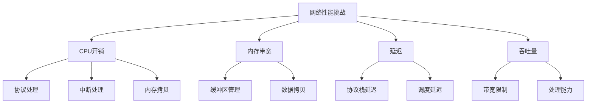

## 硬件卸载技术

### 1. TCP/IP卸载引擎（TOE）

TOE将TCP/IP协议栈处理卸载到网卡硬件：

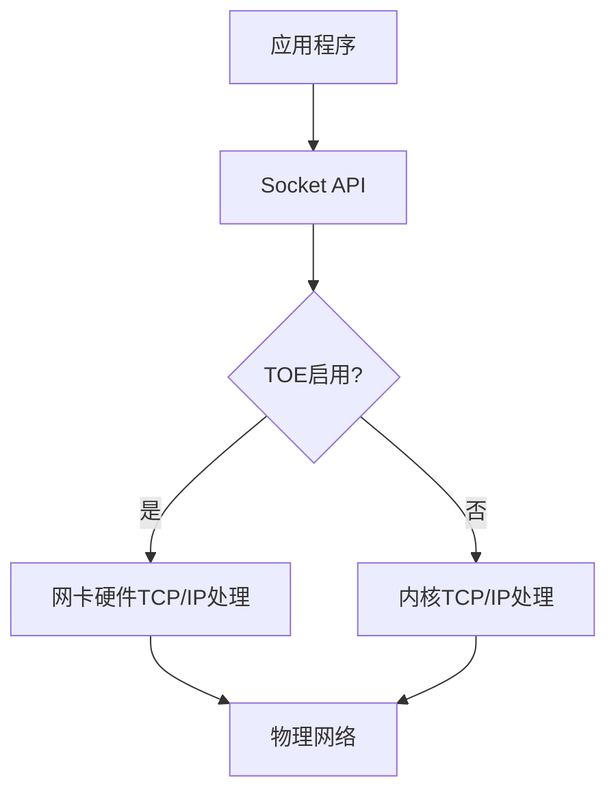

优点：
- 减轻CPU负担
- 降低主机内存带宽使用
- 减少中断处理开销

缺点：
- 硬件实现固定，难以更新协议
- 与操作系统协议栈功能可能不完全兼容

### 2. 校验和卸载

将IP、TCP、UDP校验和计算卸载到网卡硬件：

```c
// 启用校验和卸载的示例代码
struct ethtool_value eval;
struct ifreq ifr;

strncpy(ifr.ifr_name, "eth0", IFNAMSIZ);
ifr.ifr_data = (char *)&eval;

// 获取当前标志
eval.cmd = ETHTOOL_GTXCSUM;
ioctl(fd, SIOCETHTOOL, &ifr);

// 启用发送校验和卸载
eval.data = 1;
eval.cmd = ETHTOOL_STXCSUM;
ioctl(fd, SIOCETHTOOL, &ifr);
```

### 3. 分段卸载（TSO/GSO/UFO）

- **TSO (TCP Segmentation Offload)**：将大TCP段的分段操作卸载到网卡
- **GSO (Generic Segmentation Offload)**：软件层面的分段延迟
- **UFO (UDP Fragmentation Offload)**：UDP数据包分片卸载

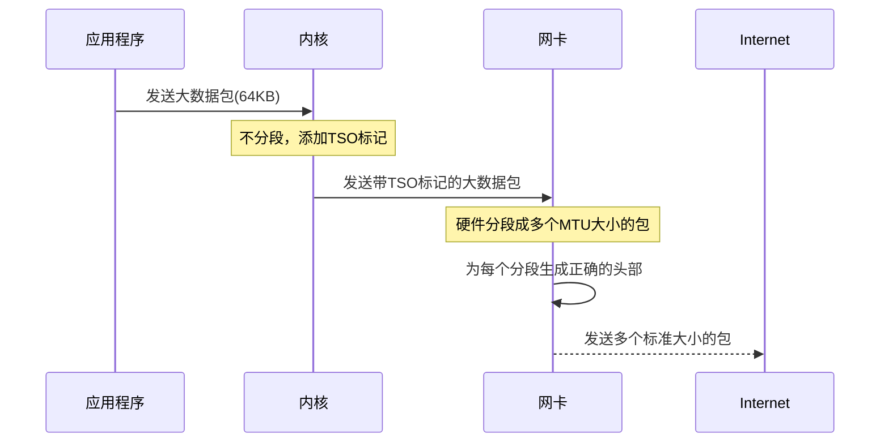

### 4. 接收端扩展（GRO/LRO）

- **GRO (Generic Receive Offload)**：在协议栈中合并接收的数据包
- **LRO (Large Receive Offload)**：在网卡硬件中合并接收的数据包

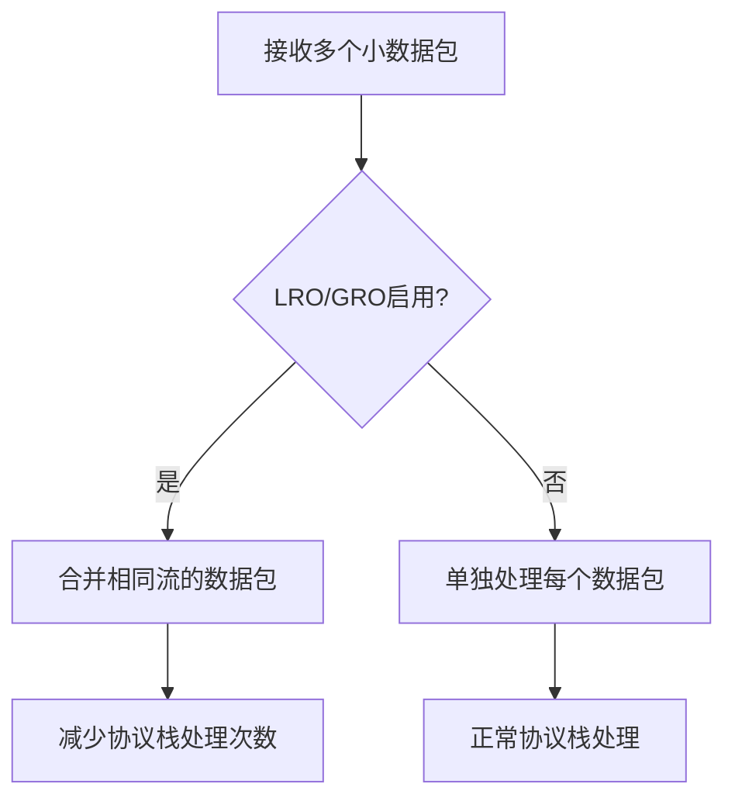

## 内核参数优化

### 1. 网络缓冲区调优

```bash
# 增加接收和发送缓冲区的最大值
sysctl -w net.core.rmem_max=16777216
sysctl -w net.core.wmem_max=16777216

# 增加自动调整的TCP缓冲区范围
sysctl -w net.ipv4.tcp_rmem="4096 87380 16777216"
sysctl -w net.ipv4.tcp_wmem="4096 65536 16777216"

# 启用TCP缓冲区自动调整
sysctl -w net.ipv4.tcp_moderate_rcvbuf=1
```

### 2. TCP协议参数优化

```bash
# 启用TCP快速打开
sysctl -w net.ipv4.tcp_fastopen=3

# 启用SACK（选择性确认）
sysctl -w net.ipv4.tcp_sack=1

# 启用TCP时间戳
sysctl -w net.ipv4.tcp_timestamps=1

# 调整TCP拥塞控制算法
sysctl -w net.ipv4.tcp_congestion_control=bbr
```

### 3. 中断处理优化

```bash
# 设置网卡多队列的中断亲和性
for i in $(seq 0 7); do
  echo $((2**$i)) > /proc/irq/$((40+$i))/smp_affinity
done
```

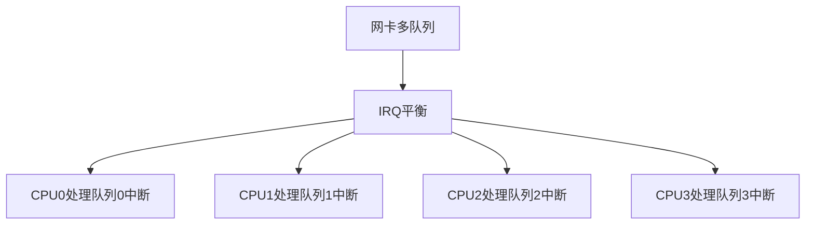

## 新技术应用

### 1. XDP (eXpress Data Path)

XDP是一种高性能数据包处理技术，允许在网络栈的最早期处理数据包：

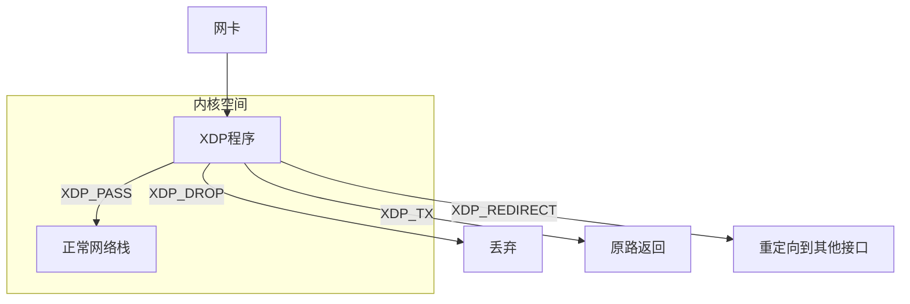

XDP程序示例（丢弃所有UDP数据包）：

```c
#include <linux/bpf.h>
#include <linux/if_ether.h>
#include <linux/ip.h>
#include <linux/udp.h>

SEC("xdp")
int xdp_drop_udp(struct xdp_md *ctx) {
    void *data_end = (void *)(long)ctx->data_end;
    void *data = (void *)(long)ctx->data;
    struct ethhdr *eth = data;
    
    // 确保数据包至少包含以太网头部
    if (data + sizeof(*eth) > data_end)
        return XDP_PASS;
    
    // 检查是否为IP数据包
    if (eth->h_proto != htons(ETH_P_IP))
        return XDP_PASS;
    
    struct iphdr *ip = data + sizeof(*eth);
    
    // 确保数据包至少包含IP头部
    if ((void *)ip + sizeof(*ip) > data_end)
        return XDP_PASS;
    
    // 检查是否为UDP数据包
    if (ip->protocol != IPPROTO_UDP)
        return XDP_PASS;
    
    // 丢弃UDP数据包
    return XDP_DROP;
}
```

### 2. AF_XDP

AF_XDP是一种高性能套接字，允许用户空间程序直接访问XDP处理的数据包：

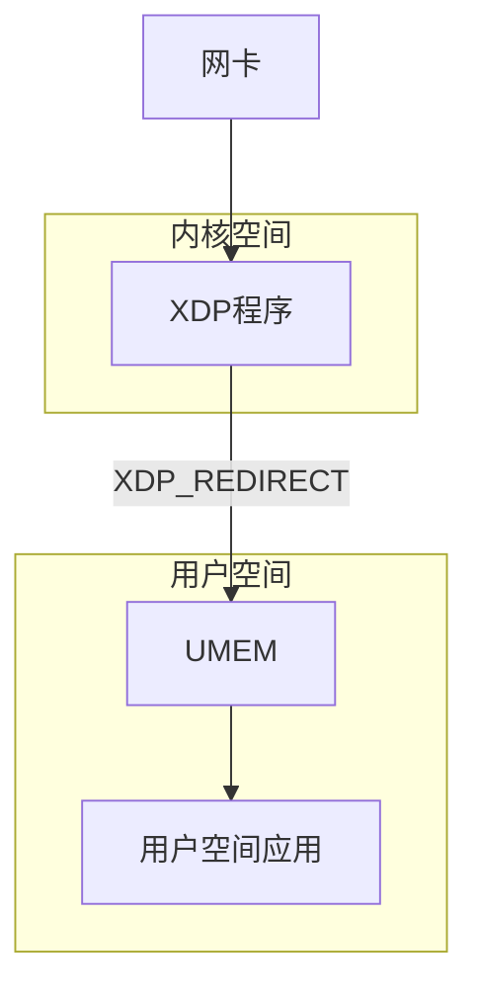

### 3. eBPF网络功能

eBPF允许在网络栈的多个点注入自定义处理逻辑：

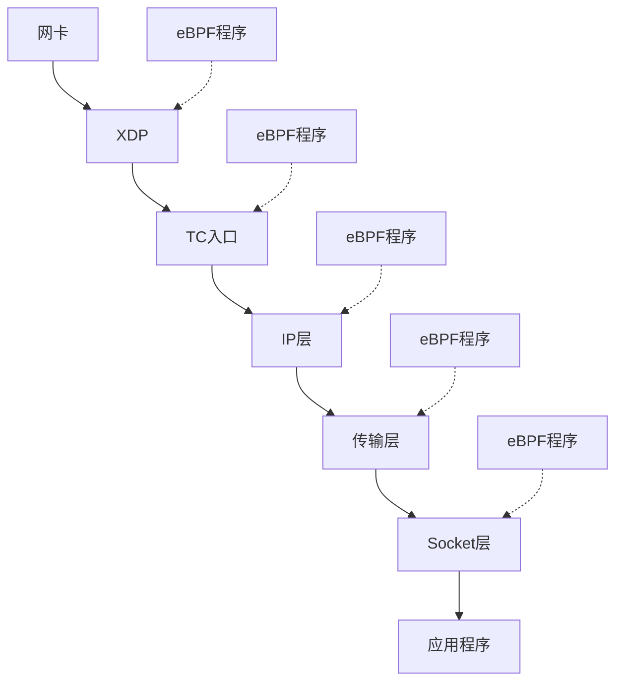

## 架构优化

### 1. NAPI (New API)

NAPI是Linux中用于网络设备驱动的API，结合了中断和轮询处理：

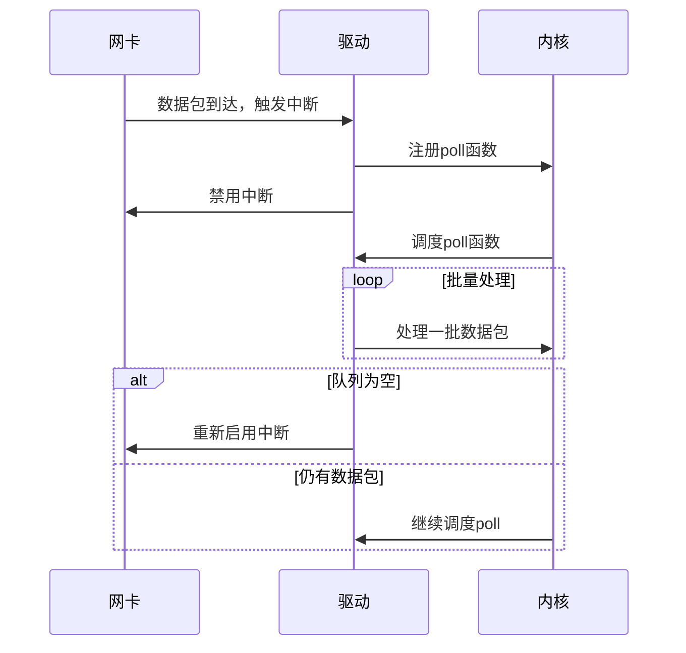

### 2. 多队列网卡支持

多队列网卡允许并行处理数据包：

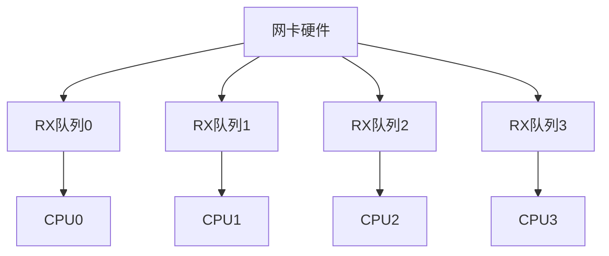

### 3. RSS (Receive Side Scaling)

RSS根据数据包的流信息将其分发到不同的处理队列：

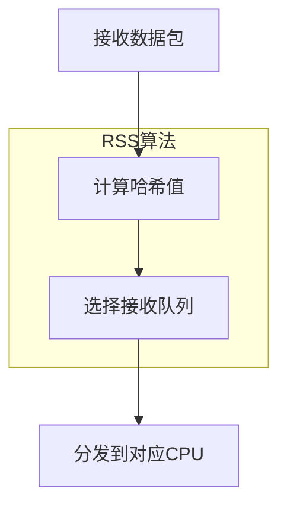

### 4. RPS (Receive Packet Steering)

RPS是RSS的软件实现，适用于不支持硬件多队列的网卡：

```bash
# 启用RPS，设置CPU掩码
echo "f" > /sys/class/net/eth0/queues/rx-0/rps_cpus
```

### 5. RFS (Receive Flow Steering)

RFS尝试将数据包定向到处理应用程序的CPU：

```bash
# 启用RFS，设置表项数量
echo 32768 > /proc/sys/net/core/rps_sock_flow_entries
echo 32768 > /sys/class/net/eth0/queues/rx-0/rps_flow_cnt
```

## 零拷贝技术

### 1. sendfile系统调用

```c
// 使用sendfile直接从文件发送到socket
ssize_t sendfile(int out_fd, int in_fd, off_t *offset, size_t count);
```

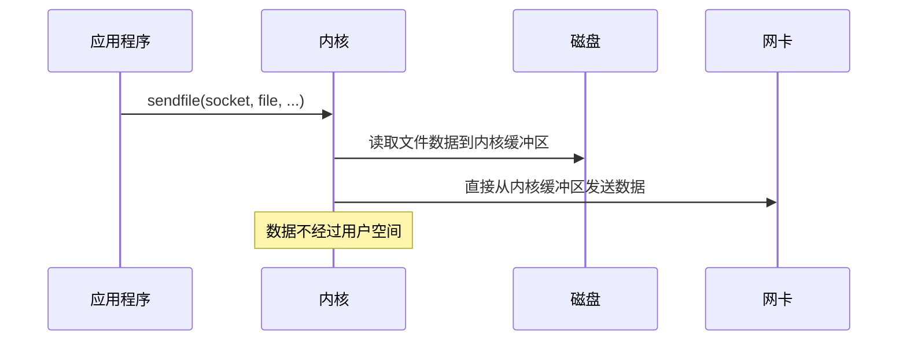

### 2. mmap + write

```c
// 使用mmap映射文件到内存，然后写入socket
void *addr = mmap(NULL, length, PROT_READ, MAP_PRIVATE, fd, 0);
write(sockfd, addr, length);
munmap(addr, length);
```

### 3. splice系统调用

```c
// 在两个文件描述符之间移动数据，无需经过用户空间
ssize_t splice(int fd_in, loff_t *off_in, int fd_out, loff_t *off_out,