# 数据包生命周期

## 概述

数据包在Linux网络协议栈中的生命周期是理解网络性能和问题排查的基础。本文详细分析数据包从应用程序到网络设备（发送路径）以及从网络设备到应用程序（接收路径）的完整流程，包括各层处理逻辑和关键数据结构。

## 数据包发送路径

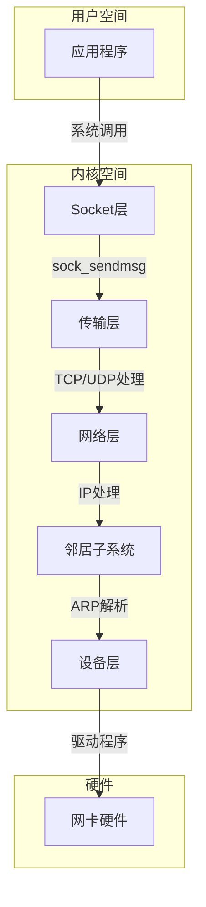

### 1. 应用层到Socket层

应用程序通过系统调用（如`send`、`sendto`、`sendmsg`、`write`）发送数据：

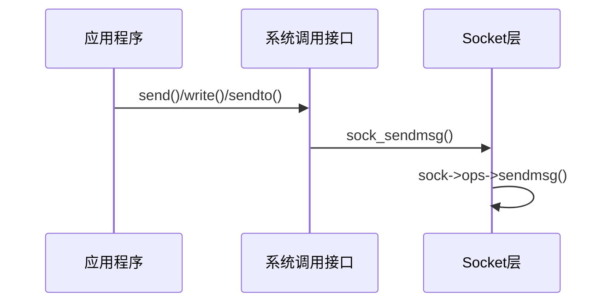

关键步骤：

1. 系统调用进入内核态
2. 根据文件描述符找到对应的socket结构
3. 调用特定协议的发送函数（如TCP的`tcp_sendmsg`）

### 2. 传输层处理

以TCP为例，传输层主要完成以下工作：

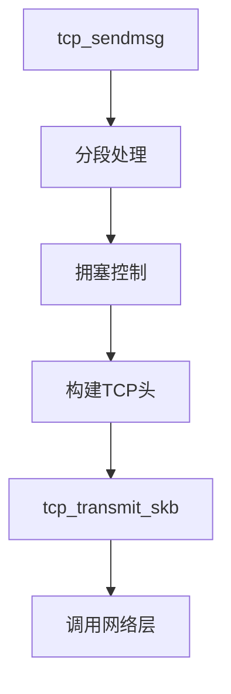

关键数据结构：

- **sk_buff（skb）**：内核中表示网络数据包的核心结构
- **tcp_sock**：TCP协议特定的socket结构

关键函数：

- `tcp_sendmsg`：处理TCP发送请求
- `tcp_push_one`：尝试发送一个TCP段
- `tcp_transmit_skb`：传输一个TCP段

### 3. 网络层处理

IP层负责路由决策和IP头构建：

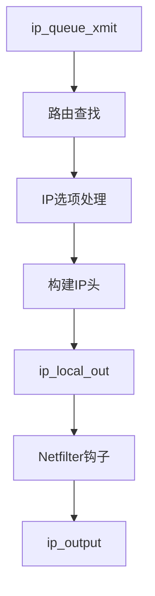

关键步骤：

1. 路由查找决定下一跳和出口设备
2. 构建IP头（设置源IP、目标IP、TTL等）
3. 经过Netfilter钩子点（允许防火墙处理）
4. 调用`dst_output`发送到下一层

### 4. 邻居子系统

邻居子系统负责解析下一跳的MAC地址：

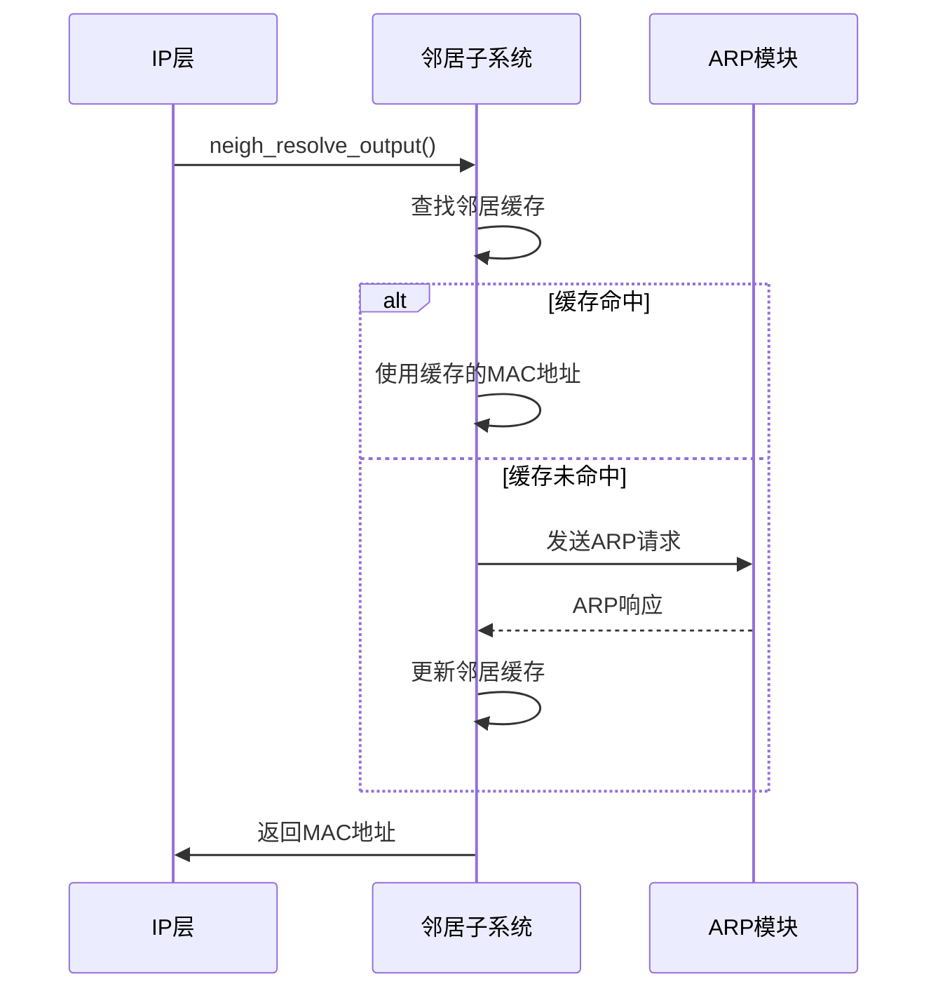

关键数据结构：

- **neighbour**：表示邻居缓存条目
- **neigh_table**：邻居协议操作表

### 5. 设备层处理

设备层负责构建以太网帧并交给驱动程序：

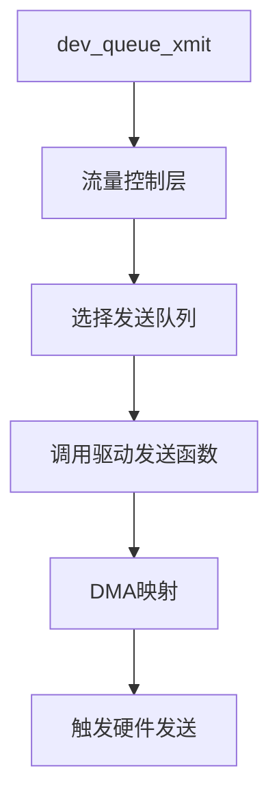

关键步骤：

1. 流量整形和队列规则（QoS）处理
2. 选择合适的发送队列（多队列网卡）
3. 调用网卡驱动的`ndo_start_xmit`函数
4. 驱动程序将skb数据映射到DMA区域
5. 通知网卡硬件发送数据

## 数据包接收路径

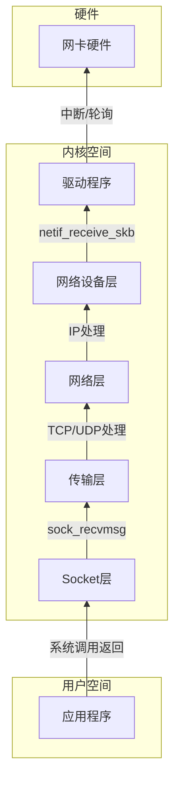

### 1. 硬件和驱动层

数据包接收通常从硬件中断开始：

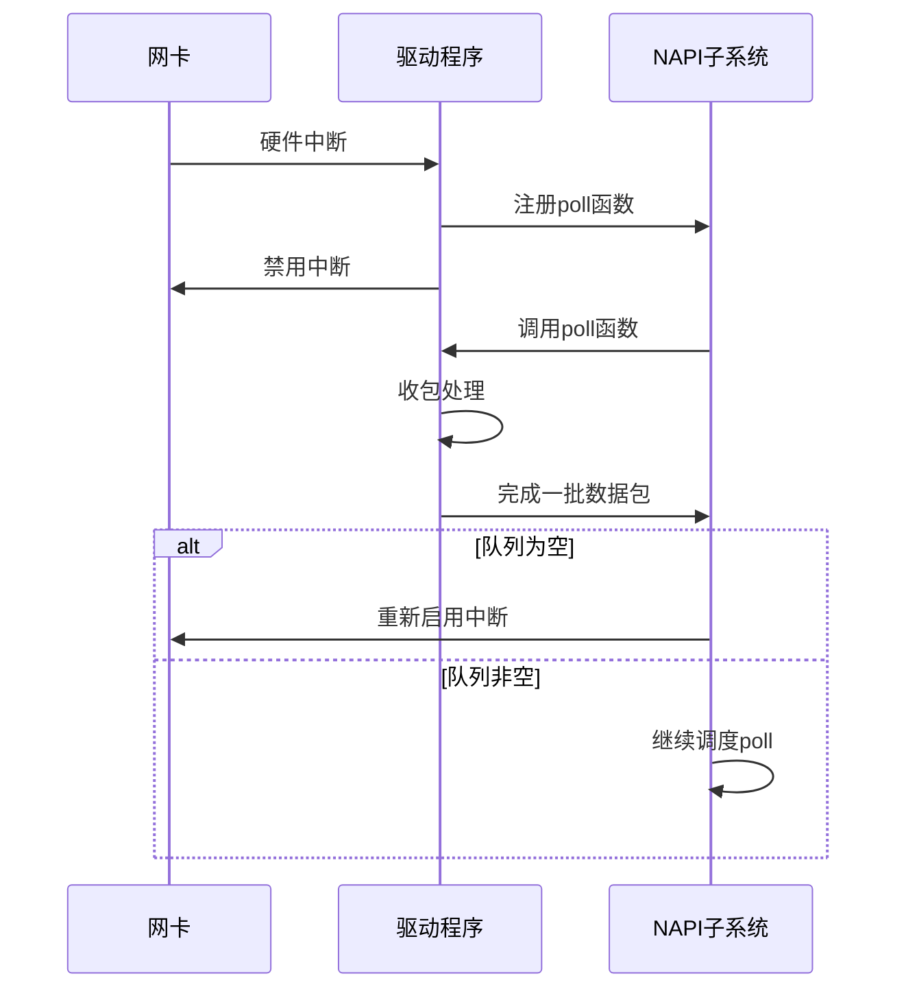

关键步骤：

1. 网卡接收数据包并触发硬件中断
2. 驱动中断处理程序注册NAPI（New API）轮询函数
3. 禁用网卡中断，避免中断风暴
4. 内核调度NAPI轮询函数批量处理数据包
5. 驱动分配skb并从DMA区域复制数据
6. 设置skb元数据（协议类型、设备等）
7. 调用`netif_receive_skb`将数据包传递给网络栈

### 2. 网络设备层

网络设备层处理通用的数据包接收逻辑：

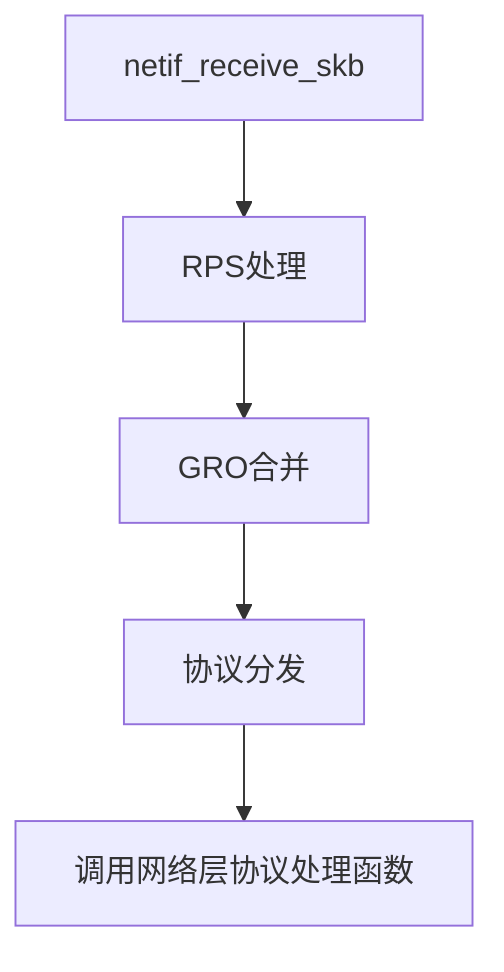

关键功能：

- **RPS（Receive Packet Steering）**：将接收处理分散到多个CPU
- **GRO（Generic Receive Offload）**：合并类似的数据包减少处理开销
- **协议分发**：根据以太网类型字段将数据包传递给相应的网络层协议

### 3. 网络层处理

IP层处理接收的数据包：

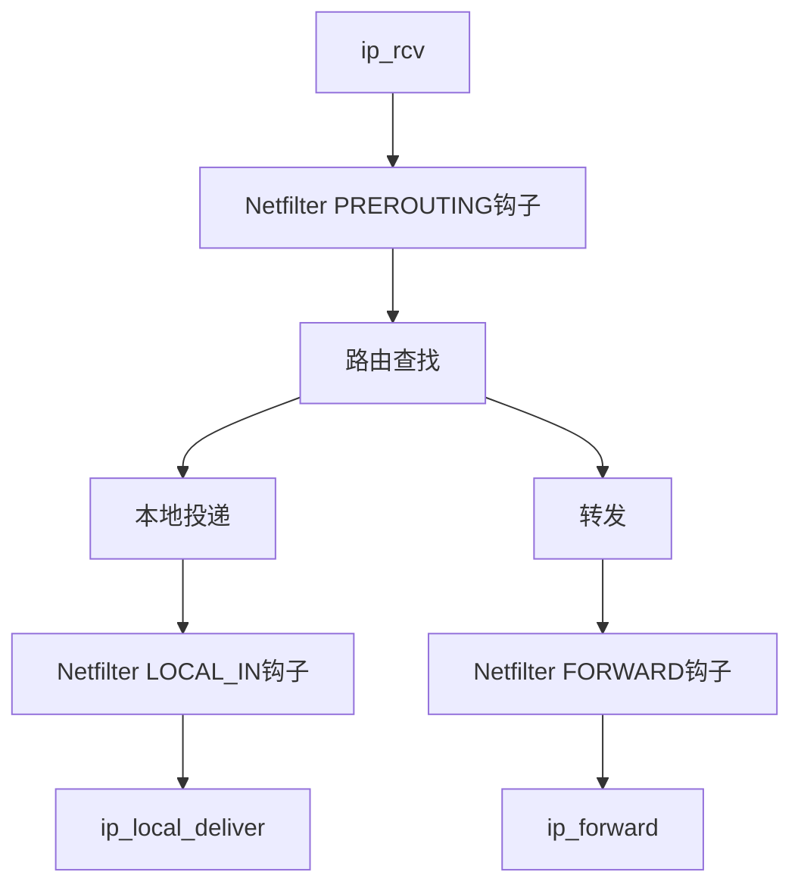

关键步骤：

1. 验证IP头部正确性
2. 经过Netfilter PREROUTING钩子（允许DNAT等处理）
3. 路由查找决定数据包是本地投递还是转发
4. 本地投递的数据包经过LOCAL_IN钩子后传递给传输层
5. 转发的数据包经过FORWARD和POSTROUTING钩子后发送出去

### 4. 传输层处理

以TCP为例的传输层处理：

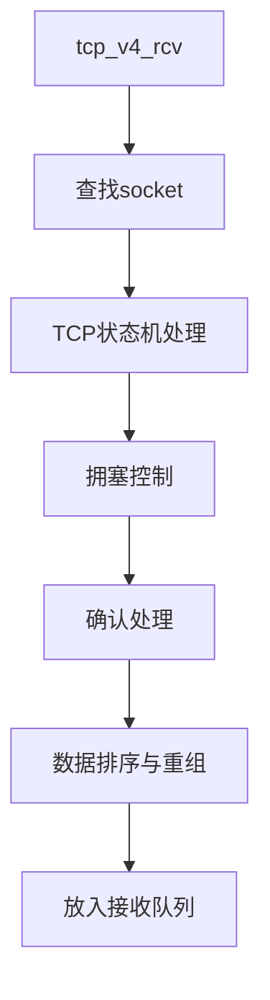

关键步骤：

1. 根据四元组（源IP、源端口、目标IP、目标端口）查找对应socket
2. 根据TCP状态机处理数据包
3. 发送确认（ACK）
4. 将数据放入socket接收队列
5. 唤醒等待数据的进程

### 5. Socket层到应用层

应用程序通过系统调用（如`recv`、`recvfrom`、`recvmsg`、`read`）接收数据：

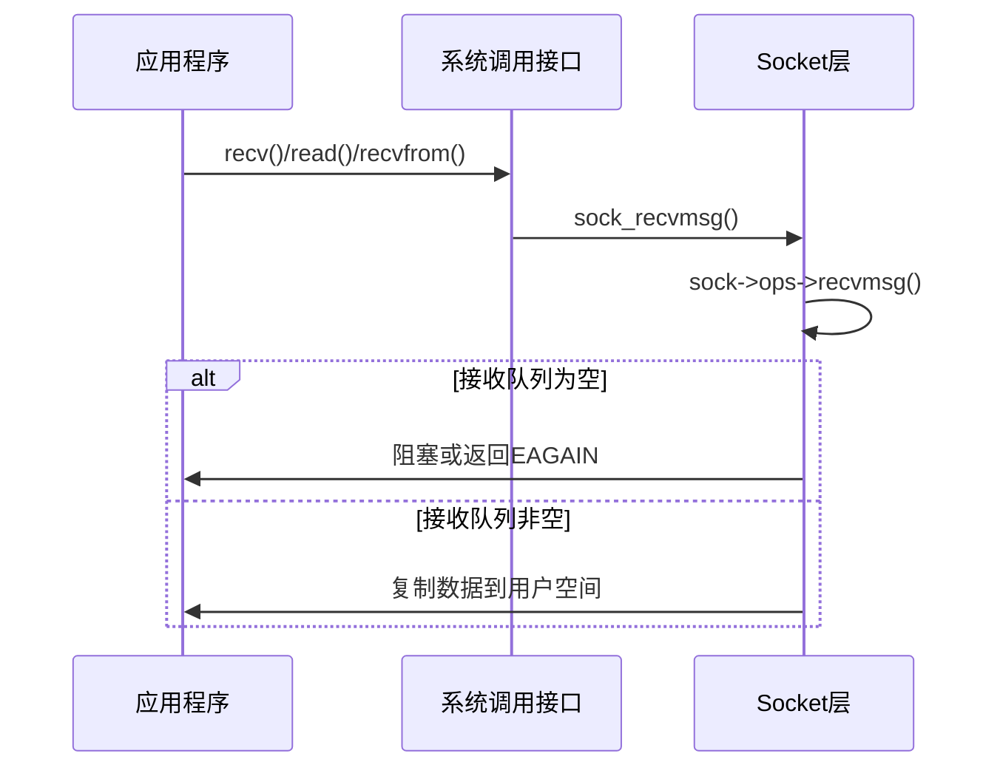

关键步骤：

1. 系统调用进入内核态
2. 根据文件描述符找到对应的socket
3. 调用特定协议的接收函数（如TCP的`tcp_recvmsg`）
4. 如果接收队列为空，根据socket标志决定阻塞等待或返回错误
5. 从接收队列获取数据并复制到用户空间

## 关键数据结构

### 1. sk_buff（Socket Buffer）

sk_buff是网络栈中表示数据包的核心数据结构：

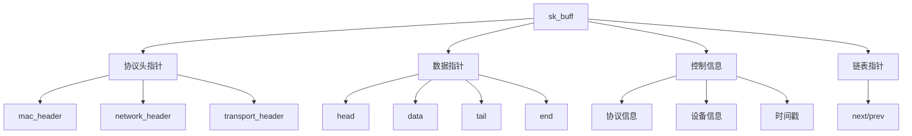

主要字段：

- **协议头指针**：指向各层协议头的指针
- **数据指针**：指向实际数据的指针
- **控制信息**：包含协议特定信息、设备信息等
- **链表指针**：用于将多个sk_buff链接成队列

### 2. net_device

net_device表示网络设备：

```c
struct net_device {
    char name[IFNAMSIZ];           /* 设备名称 */
    unsigned long state;            /* 设备状态 */
    const struct net_device_ops *netdev_ops; /* 设备操作函数 */
    const struct ethtool_ops *ethtool_ops;   /* 配置操作函数 */
    unsigned int flags;             /* 设备标志 */
    unsigned int features;          /* 特性标志 */
    /* ... 更多字段 ... */
};
```