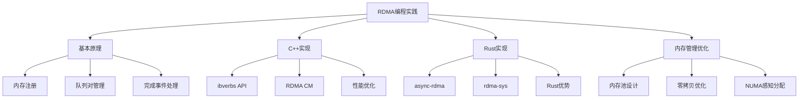

---
tags:
  - 网络编程
  - 高性能
  - RDMA
  - 内存管理
  - C++
  - Rust
---

# RDMA编程实践

## 概述

RDMA（Remote Direct Memory Access，远程直接内存访问）是一种高性能网络通信技术，允许计算机通过网络直接访问远程计算机的内存，而无需操作系统的干预。本文将深入探讨RDMA的编程实践，包括C++和Rust的实现对比，以及内存管理优化技术，为高性能网络应用开发提供指导。



## RDMA基本原理

### RDMA通信模型

RDMA通信模型基于以下核心概念：

1. **内存注册（Memory Registration）**：应用程序需要将内存区域注册到RDMA网卡，生成一个唯一的密钥（Key），用于标识和访问该内存区域。

2. **队列对（Queue Pair, QP）**：RDMA使用发送队列（SQ）和接收队列（RQ）来管理数据传输请求。每个队列对（QP）包含一个SQ和一个RQ，用于异步处理数据传输。

3. **完成队列（Completion Queue, CQ）**：用于存储已完成的RDMA操作的结果，应用程序可以轮询CQ或通过事件通知机制获取操作完成状态。

4. **数据传输操作**：
   - **单边操作（One-sided）**：如RDMA Read和RDMA Write，无需远程主机的CPU参与。
   - **双边操作（Two-sided）**：如Send和Receive，需要远程主机的CPU参与。

### RDMA协议实现

RDMA有三种主要的硬件实现方式：

1. **InfiniBand（IB）**：专为RDMA设计的网络协议，提供最高的性能和可靠性。

2. **RoCE（RDMA over Converged Ethernet）**：基于以太网的RDMA技术，支持在标准以太网基础设施上运行。

3. **iWARP（Internet Wide Area RDMA Protocol）**：基于TCP/IP协议的RDMA技术，兼容现有以太网基础设施。

## C++实现RDMA

### ibverbs API基础

C++中实现RDMA通常使用libibverbs库，这是一个用户空间库，提供了与RDMA设备交互的API。

#### 基本工作流程

```cpp
// 1. 打开设备并分配保护域（PD）
struct ibv_context* context = ibv_open_device(device);
struct ibv_pd* pd = ibv_alloc_pd(context);

// 2. 注册内存区域（MR）
void* buffer = malloc(buffer_size);
struct ibv_mr* mr = ibv_reg_mr(pd, buffer, buffer_size, 
                             IBV_ACCESS_LOCAL_WRITE | 
                             IBV_ACCESS_REMOTE_READ | 
                             IBV_ACCESS_REMOTE_WRITE);

// 3. 创建完成队列（CQ）
struct ibv_cq* cq = ibv_create_cq(context, cq_size, nullptr, nullptr, 0);

// 4. 创建队列对（QP）
struct ibv_qp_init_attr qp_init_attr = {};
qp_init_attr.qp_type = IBV_QPT_RC; // 可靠连接
qp_init_attr.sq_sig_all = 1; // 所有发送请求都生成完成事件
qp_init_attr.send_cq = cq;
qp_init_attr.recv_cq = cq;
qp_init_attr.cap.max_send_wr = max_send_wr;
qp_init_attr.cap.max_recv_wr = max_recv_wr;
qp_init_attr.cap.max_send_sge = max_sge;
qp_init_attr.cap.max_recv_sge = max_sge;

struct ibv_qp* qp = ibv_create_qp(pd, &qp_init_attr);

// 5. 转换QP状态（初始化、RTR、RTS）
// 省略QP状态转换代码...

// 6. 发布发送请求（RDMA Write示例）
struct ibv_sge sge = {};
sge.addr = (uintptr_t)buffer;
sge.length = buffer_size;
sge.lkey = mr->lkey;

struct ibv_send_wr wr = {};
wr.wr_id = 1;
wr.sg_list = &sge;
wr.num_sge = 1;
wr.opcode = IBV_WR_RDMA_WRITE;
wr.send_flags = IBV_SEND_SIGNALED;
wr.wr.rdma.remote_addr = remote_addr;
wr.wr.rdma.rkey = remote_rkey;

struct ibv_send_wr* bad_wr = nullptr;
ibv_post_send(qp, &wr, &bad_wr);

// 7. 轮询完成队列
struct ibv_wc wc = {};
while (ibv_poll_cq(cq, 1, &wc) == 0) {}
if (wc.status != IBV_WC_SUCCESS) {
    // 处理错误
}
```

### RDMA CM（连接管理）

RDMA CM（Connection Manager）提供了类似于套接字API的接口，简化了RDMA连接的建立和管理。

```cpp
// 创建RDMA CM ID
struct rdma_event_channel* ec = rdma_create_event_channel();
struct rdma_cm_id* id = nullptr;
rdma_create_id(ec, &id, nullptr, RDMA_PS_TCP);

// 绑定地址（服务器端）
struct sockaddr_in addr = {};
addr.sin_family = AF_INET;
addr.sin_port = htons(port);
addr.sin_addr.s_addr = INADDR_ANY;
rdma_bind_addr(id, (struct sockaddr*)&addr);

// 监听连接（服务器端）
rdma_listen(id, 10);

// 接受连接（服务器端）
struct rdma_cm_id* client_id = nullptr;
rdma_get_request(id, &client_id);
// 设置QP属性...
rdma_accept(client_id, nullptr);

// 连接到服务器（客户端）
addr.sin_addr.s_addr = inet_addr(server_ip);
rdma_resolve_addr(id, nullptr, (struct sockaddr*)&addr, timeout_ms);
// 等待地址解析事件...
rdma_resolve_route(id, timeout_ms);
// 等待路由解析事件...
// 设置QP属性...
rdma_connect(id, nullptr);
```

## Rust实现RDMA

### async-rdma库

Rust中实现RDMA可以使用`async-rdma`库，它提供了异步API，结合Rust的所有权系统，使RDMA编程更加安全和高效。

```rust
use async_rdma::{RdmaBuilder, LocalMrReadAccess, LocalMrWriteAccess, RemoteMrReadAccess, RemoteMrWriteAccess};
use std::net::{Ipv4Addr, SocketAddrV4};

#[tokio::main]
async fn main() -> Result<(), Box<dyn std::error::Error>> {
    // 创建RDMA连接（服务器端）
    let addr = SocketAddrV4::new(Ipv4Addr::new(0, 0, 0, 0), 8080);
    let listener = RdmaBuilder::default().listen(addr).await?;
    let rdma = listener.accept().await?;
    
    // 分配和注册本地内存区域
    let mut lmr = rdma.alloc_local_mr(4096)?;
    
    // 写入数据到本地内存
    let data = b"Hello, RDMA!";
    let mut lmr_write = lmr.get_write_access().await?;
    lmr_write.write(0, data)?;
    drop(lmr_write);
    
    // 获取远程内存区域信息
    let rmr = rdma.receive_remote_mr().await?;
    
    // 执行RDMA写操作
    let lmr_read = lmr.get_read_access().await?;
    let rmr_write = rmr.get_write_access();
    rdma.write(&lmr_read, 0, &rmr_write, 0, data.len()).await?;
    
    // 执行RDMA读操作
    let mut read_buffer = vec![0u8; data.len()];
    let mut lmr_write = lmr.get_write_access().await?;
    let rmr_read = rmr.get_read_access();
    rdma.read(&rmr_read, 0, &mut lmr_write, 0, data.len()).await?;
    lmr_write.read(0, &mut read_buffer)?;
    
    println!("Read from remote: {}", String::from_utf8_lossy(&read_buffer));
    
    Ok(())
}
```

### rdma-sys低级绑定

对于需要更底层控制的场景，可以使用`rdma-sys`库，它提供了对ibverbs API的Rust绑定。

```rust
use rdma_sys::*;
use std::ptr;
use std::mem;

fn main() -> Result<(), Box<dyn std::error::Error>> {
    unsafe {
        // 获取设备列表
        let mut num_devices = 0;
        let devices = ibv_get_device_list(&mut num_devices);
        if devices.is_null() || num_devices == 0 {
            return Err("No RDMA devices found".into());
        }
        
        // 打开设备
        let device = *devices;
        let context = ibv_open_device(device);
        if context.is_null() {
            return Err("Failed to open device".into());
        }
        
        // 分配保护域
        let pd = ibv_alloc_pd(context);
        if pd.is_null() {
            return Err("Failed to allocate PD".into());
        }
        
        // 注册内存区域
        let buffer_size = 4096;
        let buffer = libc::malloc(buffer_size) as *mut u8;
        let mr = ibv_reg_mr(pd, buffer as *mut _, buffer_size,
                          (ibv_access_flags::IBV_ACCESS_LOCAL_WRITE |
                           ibv_access_flags::IBV_ACCESS_REMOTE_READ |
                           ibv_access_flags::IBV_ACCESS_REMOTE_WRITE) as _);
        if mr.is_null() {
            return Err("Failed to register MR".into());
        }
        
        // 创建完成队列
        let cq = ibv_create_cq(context, 10, ptr::null_mut(), ptr::null_mut(), 0);
        if cq.is_null() {
            return Err("Failed to create CQ".into());
        }
        
        // 创建队列对
        let mut qp_init_attr: ibv_qp_init_attr = mem::zeroed();
        qp_init_attr.qp_type = ibv_qp_type::IBV_QPT_RC;
        qp_init_attr.sq_sig_all = 1;
        qp_init_attr.send_cq = cq;
        qp_init_attr.recv_cq = cq;
        qp_init_attr.cap.max_send_wr = 10;
        qp_init_attr.cap.max_recv_wr = 10;
        qp_init_attr.cap.max_send_sge = 1;
        qp_init_attr.cap.max_recv_sge = 1;
        
        let qp = ibv_create_qp(pd, &mut qp_init_attr);
        if qp.is_null() {
            return Err("Failed to create QP".into());
        }
        
        // 清理资源
        ibv_destroy_qp(qp);
        ibv_destroy_cq(cq);
        ibv_dereg_mr(mr);
        ibv_dealloc_pd(pd);
        ibv_close_device(context);
        ibv_free_device_list(devices);
        libc::free(buffer as *mut _);
        
        Ok(())
    }
}
```

### Rust的RDMA优势

Rust在RDMA编程中具有以下优势：

1. **内存安全**：Rust的所有权系统和借用检查器可以在编译时防止内存泄漏和数据竞争，这对于RDMA编程中的内存管理尤为重要。

2. **零成本抽象**：Rust提供了高级抽象，同时保持与C/C++相当的性能，适合高性能网络编程。

3. **并发安全**：Rust的类型系统和所有权模型使并发编程更加安全，减少了RDMA多线程编程中的常见错误。

4. **异步编程**：Rust的异步编程模型（如tokio）与RDMA的异步特性非常匹配，可以充分利用RDMA的性能优势。

5. **错误处理**：Rust的Result类型使错误处理更加明确和可靠，有助于提高RDMA应用的稳定性。

## 内存管理优化技术

### 内存池设计

RDMA应用中，内存注册是一个昂贵的操作，因此使用内存池可以显著提高性能。

```cpp
class RdmaMemoryPool {
private:
    struct MemoryBlock {
        void* addr;          // 内存块地址
        size_t size;         // 内存块大小
        struct ibv_mr* mr;   // 注册的内存区域
        bool in_use;         // 是否在使用中
    };
    
    std::vector<MemoryBlock> blocks_;
    struct ibv_pd* pd_;      // 保护域
    std::mutex mutex_;       // 保护内存池访问
    
    // 预分配内存块并注册
    void preAllocate(size_t block_size, size_t num_blocks) {
        for (size_t i = 0; i < num_blocks; ++i) {
            void* addr = aligned_alloc(4096, block_size); // 页对齐分配
            struct ibv_mr* mr = ibv_reg_mr(pd_, addr, block_size,
                                         IBV_ACCESS_LOCAL_WRITE |
                                         IBV_ACCESS_REMOTE_READ |
                                         IBV_ACCESS_REMOTE_WRITE);
            if (mr) {
                blocks_.push_back({addr, block_size, mr, false});
            } else {
                free(addr);
                // 处理错误
            }
        }
    }
    
public:
    RdmaMemoryPool(struct ibv_pd* pd, size_t block_size, size_t num_blocks)
        : pd_(pd) {
        preAllocate(block_size, num_blocks);
    }
    
    ~RdmaMemoryPool() {
        for (auto& block : blocks_) {
            ibv_dereg_mr(block.mr);
            free(block.addr);
        }
    }
    
    // 分配内存块
    MemoryRegion allocate() {
        std::lock_guard<std::mutex> lock(mutex_);
        for (auto& block : blocks_) {
            if (!block.in_use) {
                block.in_use = true;
                return {block.addr, block.size, block.mr->lkey, block.mr->rkey};
            }
        }
        return {nullptr, 0, 0, 0}; // 内存池耗尽
    }
    
    // 释放内存块
    void deallocate(void* addr) {
        std::lock_guard<std::mutex> lock(mutex_);
        for (auto& block : blocks_) {
            if (block.addr == addr) {
                block.in_use = false;
                return;
            }
        }
    }
};
```

### 零拷贝优化

RDMA本身就是一种零拷贝技术，但在应用层面还可以进一步优化：

1. **避免中间缓冲区**：直接在注册的内存区域中构建和处理数据，避免额外的内存拷贝。

2. **批量处理**：合并多个小数据包为一个大数据包，减少RDMA操作次数。

3. **内存映射**：使用mmap将文件直接映射到RDMA注册的内存区域，实现文件传输的零拷贝。

```cpp
// 使用mmap和RDMA实现文件零拷贝传输
void* file_addr = mmap(nullptr, file_size, PROT_READ | PROT_WRITE, MAP_SHARED, fd, 0);
struct ibv_mr* mr = ibv_reg_mr(pd, file_addr, file_size, 
                             IBV_ACCESS_LOCAL_WRITE | 
                             IBV_ACCESS_REMOTE_READ);
// 现在可以直接通过RDMA传输文件内容，无需额外拷贝
```

### NUMA感知分配

在多NUMA节点系统中，内存分配的位置对RDMA性能有显著影响：

1. **本地分配**：确保RDMA内存在与RDMA设备相同的NUMA节点上分配。

2. **亲和性设置**：将RDMA相关线程绑定到特定CPU核心，减少NUMA跨节点访问。

```cpp
// 在特定NUMA节点上分配内存
void* numa_alloc(size_t size, int node) {
    numa_set_preferred(node);
    void* addr = aligned_alloc(4096, size);
    return addr;
}

// 设置线程亲和性
void set_thread_affinity(int cpu) {
    cpu_set_t cpuset;
    CPU_ZERO(&cpuset);
    CPU_SET(cpu, &cpuset);
    pthread_setaffinity_np(pthread_self(), sizeof(cpu_set_t), &cpuset);
}
```

## 实际应用案例

### 高性能分布式存储

RDMA在分布式存储系统中的应用示例：

```cpp
class RdmaStorageNode {
private:
    RdmaConnection conn_;
    RdmaMemoryPool mem_pool_;
    std::unordered_map<std::string, MemoryRegion> data_blocks_;
    
public:
    // 存储数据
    bool put(const std::string& key, const std::vector<uint8_t>& value) {
        // 分配内存块
        auto mr = mem_pool_.allocate();
        if (!mr.addr) return false;
        
        // 复制数据到内存块
        memcpy(mr.addr, value.data(), value.size());
        
        // 记录键值映射
        data_blocks_[key] = mr;
        
        // 通知其他节点数据位置信息
        broadcastMetadata(key, mr);
        
        return true;
    }
    
    // 读取远程数据
    std::vector<uint8_t> get(const std::string& key, const RemoteMemoryRegion& remote_mr) {
        // 分配本地内存用于接收数据
        auto local_mr = mem_pool_.allocate();
        if (!local_mr.addr) return {};
        
        // 执行RDMA读操作
        conn_.rdmaRead(local_mr, remote_mr);
        
        // 复制数据到返回缓冲区
        std::vector<uint8_t> result(remote_mr.size);
        memcpy(result.data(), local_mr.addr, remote_mr.size);
        
        // 释放本地内存
        mem_pool_.deallocate(local_mr.addr);
        
        return result;
    }
};
```

### 机器学习分布式训练

RDMA在机器学习分布式训练中的应用：

```cpp
class RdmaParameterServer {
private:
    std::vector<RdmaConnection> worker_conns_;
    std::unordered_map<std::string, MemoryRegion> model_params_;
    RdmaMemoryPool mem_pool_;
    
public:
    // 初始化模型参数
    void initializeModel(const std::unordered_map<std::string, std::vector<float>>& initial_params) {
        for (const auto& [name, values] : initial_params) {
            size_t size = values.size() * sizeof(float);
            auto mr = mem_pool_.allocate();
            if (!mr.addr) continue;
            
            memcpy(mr.addr, values.data(), size);
            model_params_[name] = mr;
            
            // 向所有工作节点广播参数位置信息
            for (auto& conn : worker_conns_) {
                conn.sendMetadata(name, mr);
            }
        }
    }
    
    // 更新模型参数（梯度聚合）
    void updateParameters(const std::string& param_name, const std::vector<RemoteMemoryRegion>& gradients) {
        auto& param_mr = model_params_[param_name];
        float* param_data = static_cast<float*>(param_mr.addr);
        size_t param_size = param_mr.size / sizeof(float);
        
        // 分配临时缓冲区用于接收梯度
        auto temp_mr = mem_pool_.allocate();
        if (!temp_mr.addr) return;
        
        // 聚合所有工作节点的梯度
        for (const auto& grad_mr : gradients) {
            // 读取远程梯度
            worker_conns_[grad_mr.node_id].rdmaRead(temp_mr, grad_mr);
            
            // 更新参数
            float* grad_data = static_cast<float*>(temp_mr.addr);
            for (size_t i = 0; i < param_size; ++i) {
                param_data[i] -= 0.01f * grad_data[i]; // 简单的SGD更新
            }
        }
        
        // 释放临时缓冲区
        mem_pool_.deallocate(temp_mr.addr);
    }
};
```

## 性能优化最佳实践

### 批量处理与流水线

1. **批量发布请求**：合并多个小请求为一个批量请求，减少系统调用开销。

2. **流水线处理**：在等待一个RDMA操作完成的同时，发起下一个操作，提高资源利用率。

```cpp
// 批量发布RDMA写请求
void batchRdmaWrite(const std::vector<RdmaRequest>& requests) {
    std::vector<struct ibv_send_wr> wrs(requests.size());
    std::vector<struct ibv_sge> sges(requests.size());
    
    for (size_t i = 0; i < requests.size(); ++i) {
        sges[i].addr = (uintptr_t)requests[i].local_addr;
        sges[i].length = requests[i].size;
        sges[i].lkey = requests[i].lkey;
        
        wrs[i].wr_id = i;
        wrs[i].sg_list = &sges[i];
        wrs[i].num_sge = 1;
        wrs[i].opcode = IBV_WR_RDMA_WRITE;
        wrs[i].send_flags = (i == requests.size() - 1) ? IBV_SEND_SIGNALED : 0; // 只对最后一个请求生成完成事件
        wrs[i].wr.rdma.remote_addr = requests[i].remote_addr;
        wrs[i].wr.rdma.rkey = requests[i].rkey;
        
        if (i < requests.size() - 1) {
            wrs[i].next = &wrs[i + 1];
        } else {
            wrs[i].next = nullptr;
        }
    }
    
    struct ibv_send_wr* bad_wr = nullptr;
    ibv_post_send(qp, &wrs[0], &bad_wr);
}
```

### 多线程优化

1. **专用线程**：使用专用线程处理RDMA事件和完成队列轮询，避免阻塞主线程。

2. **线程亲和性**：将RDMA相关线程绑定到特定CPU核心，提高缓存命中率。

```cpp
class RdmaCompletionPoller {
private:
    struct ibv_cq* cq_;
    std::atomic<bool> running_;
    std::thread poller_thread_;
    std::function<void(struct ibv_wc&)> completion_callback_;
    
public:
    RdmaCompletionPoller(struct ibv_cq* cq, std::function<void(struct ibv_wc&)> callback)
        : cq_(cq), running_(true), completion_callback_(std::move(callback)) {
        poller_thread_ = std::thread(&RdmaCompletionPoller::pollCq, this);
        
        // 设置线程亲和性
        cpu_set_t cpuset;
        CPU_ZERO(&cpuset);
        CPU_SET(0, &cpuset); // 绑定到核心0
        pthread_setaffinity_np(poller_thread_.native_handle(), sizeof(cpu_set_t), &cpuset);
    }
    
    ~RdmaCompletionPoller() {
        running_ = false;
        if (poller_thread_.joinable()) {
            poller_thread_.join();
        }
    }
    
private:
    void pollCq() {
        constexpr int max_wc = 10; // 一次最多处理10个完成事件
        struct ibv_wc wc[max_wc];
        
        while (running_) {
            int n = ibv_poll_cq(cq_, max_wc, wc);
            for (int i = 0; i < n; ++i) {
                completion_callback_(wc[i]);
            }
            
            // 避免CPU空转
            if (n == 0) {
                std::this_thread::sleep_for(std::chrono::microseconds(1));
            }
        }
    }
};
```

## 总结

RDMA是一种强大的高性能网络通信技术，通过绕过操作系统内核和零拷贝特性，实现了极低延迟和高带宽的数据传输。本文深入探讨了RDMA的基本原理、C++和Rust的实现对比，以及内存管理优化技术，为高性能网络应用开发提供了实用指导。

在实际应用中，RDMA技术已广泛应用于分布式存储、高性能计算和机器学习等领域，显著提升了系统性能。随着网络硬件的不断发展和软件栈的优化，RDMA将在未来的高性能系统中发挥更加重要的作用。