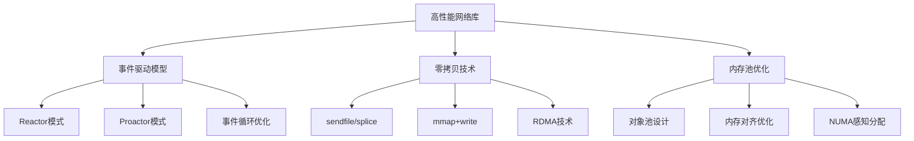
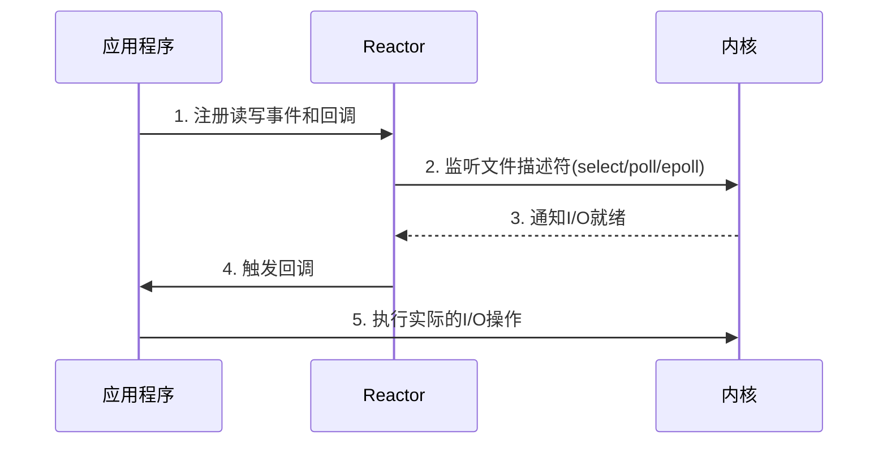
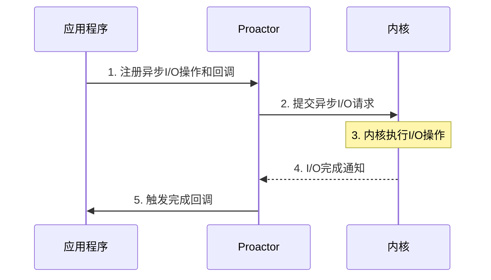
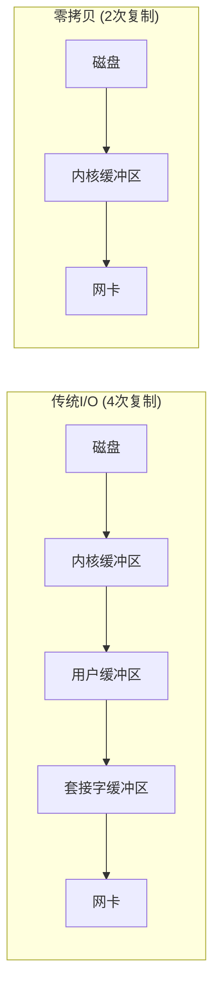
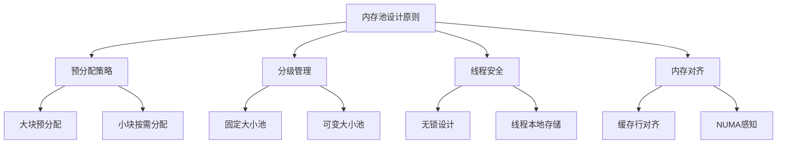

---
tags:
  - 网络编程
  - 高性能
  - 事件驱动
  - 零拷贝
  - 内存池
---

# 高性能网络库设计

## 概述

高性能网络库是现代服务器应用的核心组件，其设计直接影响系统的吞吐量、延迟和资源利用率。本文将深入探讨高性能网络库的三个关键技术：事件驱动模型实现、零拷贝网络IO和内存池优化，并通过C++和Rust的实现示例进行对比分析。



## 事件驱动模型实现

### Reactor vs Proactor

网络库的核心是I/O模型的选择，主要有两种模式：Reactor（反应器）和Proactor（前摄器）。

#### Reactor模式

Reactor模式是一种同步I/O多路复用模型，由应用程序负责读写数据。



#### C++实现示例

```cpp
class Reactor {
private:
    int epoll_fd_;
    std::unordered_map<int, std::function<void()>> read_callbacks_;
    std::unordered_map<int, std::function<void()>> write_callbacks_;
    bool running_;

public:
    Reactor() : running_(false) {
        epoll_fd_ = epoll_create1(0);
        if (epoll_fd_ < 0) {
            throw std::runtime_error("epoll_create1 failed");
        }
    }
    
    ~Reactor() {
        close(epoll_fd_);
    }
    
    // 注册读事件
    void register_read_event(int fd, std::function<void()> callback) {
        struct epoll_event ev;
        ev.events = EPOLLIN | EPOLLET; // 边缘触发模式
        ev.data.fd = fd;
        
        if (epoll_ctl(epoll_fd_, EPOLL_CTL_ADD, fd, &ev) < 0) {
            throw std::runtime_error("epoll_ctl add failed");
        }
        
        read_callbacks_[fd] = std::move(callback);
    }
    
    // 注册写事件
    void register_write_event(int fd, std::function<void()> callback) {
        struct epoll_event ev;
        ev.events = EPOLLOUT | EPOLLET; // 边缘触发模式
        ev.data.fd = fd;
        
        if (epoll_ctl(epoll_fd_, EPOLL_CTL_ADD, fd, &ev) < 0) {
            throw std::runtime_error("epoll_ctl add failed");
        }
        
        write_callbacks_[fd] = std::move(callback);
    }
    
    // 事件循环
    void run() {
        running_ = true;
        const int MAX_EVENTS = 1024;
        struct epoll_event events[MAX_EVENTS];
        
        while (running_) {
            int nfds = epoll_wait(epoll_fd_, events, MAX_EVENTS, -1);
            
            for (int i = 0; i < nfds; i++) {
                int fd = events[i].data.fd;
                
                if (events[i].events & EPOLLIN && read_callbacks_.count(fd)) {
                    read_callbacks_[fd]();
                }
                
                if (events[i].events & EPOLLOUT && write_callbacks_.count(fd)) {
                    write_callbacks_[fd]();
                }
            }
        }
    }
    
    void stop() {
        running_ = false;
    }
};
```

#### Proactor模式

Proactor模式是一种异步I/O模型，由操作系统负责读写数据，完成后通知应用程序。



#### Rust实现示例（基于Tokio）

```rust
use tokio::net::{TcpListener, TcpStream};
use tokio::io::{AsyncReadExt, AsyncWriteExt};
use std::sync::Arc;
use std::error::Error;

async fn handle_connection(mut socket: TcpStream) -> Result<(), Box<dyn Error>> {
    let mut buffer = vec![0; 1024];
    
    // 异步读取数据
    let n = socket.read(&mut buffer).await?;
    
    // 处理数据...
    let response = process_data(&buffer[..n]);
    
    // 异步写入响应
    socket.write_all(&response).await?;
    
    Ok(())
}

async fn run_server() -> Result<(), Box<dyn Error>> {
    let listener = TcpListener::bind("127.0.0.1:8080").await?;
    
    loop {
        let (socket, _) = listener.accept().await?;
        
        // 为每个连接创建一个任务
        tokio::spawn(async move {
            if let Err(e) = handle_connection(socket).await {
                eprintln!("Connection error: {}", e);
            }
        });
    }
}
```

### 事件循环优化

高性能网络库的事件循环需要精心优化：

#### 1. 批量处理事件

```cpp
// C++批量处理示例
void process_events_batch() {
    const int MAX_EVENTS = 1024;
    struct epoll_event events[MAX_EVENTS];
    
    // 一次获取多个事件
    int nfds = epoll_wait(epoll_fd_, events, MAX_EVENTS, -1);
    
    // 批量处理所有就绪事件
    for (int i = 0; i < nfds; i++) {
        // 处理事件...
    }
}
```

```rust
// Rust批量处理示例
async fn process_connections(listener: TcpListener) {
    loop {
        // 接受多个连接
        let mut connections = Vec::new();
        for _ in 0..100 {
            if let Ok((socket, _)) = listener.accept().await {
                connections.push(socket);
            } else {
                break;
            }
        }
        
        // 并发处理所有连接
        let handles: Vec<_> = connections.into_iter()
            .map(|socket| tokio::spawn(handle_connection(socket)))
            .collect();
            
        for handle in handles {
            let _ = handle.await;
        }
    }
}
```

#### 2. 避免过度唤醒

```cpp
// 使用timerfd避免频繁唤醒
int timer_fd = timerfd_create(CLOCK_MONOTONIC, 0);
struct itimerspec its;
its.it_interval.tv_sec = 1;  // 1秒间隔
its.it_interval.tv_nsec = 0;
its.it_value.tv_sec = 1;
its.it_value.tv_nsec = 0;
timerfd_settime(timer_fd, 0, &its, NULL);

// 将定时器加入epoll
struct epoll_event ev;
ev.events = EPOLLIN;
ev.data.fd = timer_fd;
epoll_ctl(epoll_fd, EPOLL_CTL_ADD, timer_fd, &ev);
```

## 零拷贝网络IO

零拷贝技术通过减少数据在内核空间和用户空间之间的复制次数，显著提高I/O性能。

### 传统I/O vs 零拷贝



### 主要零拷贝技术

#### 1. sendfile系统调用

```cpp
// C++中使用sendfile
#include <sys/sendfile.h>

void send_file_zero_copy(int out_fd, int in_fd, off_t offset, size_t count) {
    off_t offset_copy = offset;
    sendfile(out_fd, in_fd, &offset_copy, count);
}
```

```rust
// Rust中使用sendfile
use std::os::unix::io::{AsRawFd, RawFd};
use nix::sys::sendfile::sendfile;

fn send_file_zero_copy(src: &File, dst: &TcpStream, count: usize) -> Result<usize, std::io::Error> {
    let src_fd: RawFd = src.as_raw_fd();
    let dst_fd: RawFd = dst.as_raw_fd();
    
    match sendfile(dst_fd, src_fd, None, count) {
        Ok(sent) => Ok(sent),
        Err(e) => Err(std::io::Error::new(std::io::ErrorKind::Other, e))
    }
}
```

#### 2. mmap + write

```cpp
// C++中使用mmap
#include <sys/mman.h>

void mmap_zero_copy(int fd, size_t length) {
    void* mapped = mmap(NULL, length, PROT_READ, MAP_PRIVATE, fd, 0);
    if (mapped == MAP_FAILED) {
        // 错误处理
        return;
    }
    
    // 直接操作映射内存
    // ...
    
    munmap(mapped, length);
}
```

```rust
// Rust中使用mmap
use memmap2::MmapOptions;

fn mmap_zero_copy(file: &File) -> Result<(), Box<dyn Error>> {
    let mmap = unsafe { MmapOptions::new().map(file)? };
    
    // 直接操作映射内存
    // ...
    
    Ok(())
}
```

#### 3. splice系统调用

```cpp
// C++中使用splice
#include <fcntl.h>

void splice_zero_copy(int fd_in, int fd_out, size_t len) {
    int pipefd[2];
    pipe(pipefd);
    
    // 从fd_in拷贝到管道
    splice(fd_in, NULL, pipefd[1], NULL, len, SPLICE_F_MOVE);
    // 从管道拷贝到fd_out
    splice(pipefd[0], NULL, fd_out, NULL, len, SPLICE_F_MOVE);
    
    close(pipefd[0]);
    close(pipefd[1]);
}
```

### 零拷贝在Rust异步网络库中的应用

```rust
use tokio::net::TcpStream;
use tokio::io::AsyncWriteExt;
use tokio_util::codec::{FramedRead, BytesCodec};
use futures::StreamExt;
use std::fs::File;
use std::io::Result;

async fn send_file_efficiently(file: File, stream: &mut TcpStream) -> Result<()> {
    // 使用tokio的零拷贝文件发送
    let file = tokio::fs::File::from_std(file);
    let file_size = file.metadata().await?.len();
    
    // 创建帧读取器，避免一次性加载整个文件到内存
    let reader = FramedRead::new(file, BytesCodec::new());
    
    // 流式处理文件内容
    let mut reader = Box::pin(reader);
    while let Some(chunk) = reader.next().await {
        let chunk = chunk?;
        stream.write_all(&chunk).await?;
    }
    
    Ok(())
}
```

## 内存池优化

内存池是高性能网络库的关键组件，通过预分配和重用内存块，减少动态内存分配的开销。

### 内存池设计原则



### C++内存池实现

```cpp
class MemoryPool {
private:
    struct MemoryBlock {
        void* data;
        size_t size;
        MemoryBlock* next;
    };
    
    // 空闲块链表
    MemoryBlock* free_list_;
    // 已分配块链表
    MemoryBlock* allocated_list_;
    // 块大小
    size_t block_size_;
    // 预分配块数量
    size_t prealloc_count_;
    // 互斥锁
    std::mutex mutex_;
    
public:
    MemoryPool(size_t block_size, size_t prealloc_count)
        : block_size_(block_size), prealloc_count_(prealloc_count),
          free_list_(nullptr), allocated_list_(nullptr) {
        // 预分配内存块
        for (size_t i = 0; i < prealloc_count_; ++i) {
            MemoryBlock* block = new MemoryBlock;
            block->data = aligned_alloc(64, block_size_); // 缓存行对齐
            block->size = block_size_;
            block->next = free_list_;
            free_list_ = block;
        }
    }
    
    ~MemoryPool() {
        // 释放所有内存块
        while (free_list_) {
            MemoryBlock* block = free_list_;
            free_list_ = free_list_->next;
            free(block->data);
            delete block;
        }
        
        while (allocated_list_) {
            MemoryBlock* block = allocated_list_;
            allocated_list_ = allocated_list_->next;
            free(block->data);
            delete block;
        }
    }
    
    void* allocate() {
        std::lock_guard<std::mutex> lock(mutex_);
        
        if (!free_list_) {
            // 空闲列表为空，扩展内存池
            expand();
        }
        
        // 从空闲列表中取出一个块
        MemoryBlock* block = free_list_;
        free_list_ = free_list_->next;
        
        // 添加到已分配列表
        block->next = allocated_list_;
        allocated_list_ = block;
        
        return block->data;
    }
    
    void deallocate(void* ptr) {
        std::lock_guard<std::mutex> lock(mutex_);
        
        // 查找对应的内存块
        MemoryBlock** curr = &allocated_list_;
        while (*curr && (*curr)->data != ptr) {
            curr = &((*curr)->next);
        }
        
        if (!*curr) {
            // 未找到对应内存块
            return;
        }
        
        // 从已分配列表中移除
        MemoryBlock* block = *curr;
        *curr = block->next;
        
        // 添加到空闲列表
        block->next = free_list_;
        free_list_ = block;
    }
    
private:
    void expand() {
        // 扩展内存池
        for (size_t i = 0; i < prealloc_count_; ++i) {
            MemoryBlock* block = new MemoryBlock;
            block->data = aligned_alloc(64, block_size_);
            block->size = block_size_;
            block->next = free_list_;
            free_list_ = block;
        }
    }
};
```

### Rust内存池实现

```rust
use std::cell::UnsafeCell;
use std::sync::{Arc, Mutex};
use std::alloc::{alloc, dealloc, Layout};

// 内存块结构
struct MemoryBlock {
    ptr: *mut u8,
    layout: Layout,
}

// 内存池实现
struct MemoryPoolInner {
    free_blocks: Vec<MemoryBlock>,
    block_size: usize,
}

pub struct MemoryPool {
    inner: Mutex<MemoryPoolInner>,
}

impl MemoryPool {
    pub fn new(block_size: usize, prealloc_count: usize) -> Self {
        let mut free_blocks = Vec::with_capacity(prealloc_count);
        
        // 预分配内存块
        for _ in 0..prealloc_count {
            let layout = Layout::from_size_align(block_size, 64)
                .expect("Invalid layout");
            
            unsafe {
                let ptr = alloc(layout);
                free_blocks.push(MemoryBlock { ptr, layout });
            }
        }
        
        MemoryPool {
            inner: Mutex::new(MemoryPoolInner {
                free_blocks,
                block_size,
            }),
        }
    }
    
    pub fn allocate(&self) -> *mut u8 {
        let mut inner = self.inner.lock().unwrap();
        
        if inner.free_blocks.is_empty() {
            // 扩展内存池
            self.expand(&mut inner);
        }
        
        // 从空闲列表中取出一个块
        let block = inner.free_blocks.pop().unwrap();
        block.ptr
    }
    
    pub fn deallocate(&self, ptr: *mut u8) {
        let mut inner = self.inner.lock().unwrap();
        
        let layout = Layout::from_size_align(inner.block_size, 64)
            .expect("Invalid layout");
        
        inner.free_blocks.push(MemoryBlock { ptr, layout });
    }
    
    fn expand(&self, inner: &mut MemoryPoolInner) {
        // 扩展内存池
        for _ in 0..10 {
            let layout = Layout::from_size_align(inner.block_size, 64)
                .expect("Invalid layout");
            
            unsafe {
                let ptr = alloc(layout);
                inner.free_blocks.push(MemoryBlock { ptr, layout });
            }
        }
    }
}

impl Drop for MemoryPool {
    fn drop(&mut self) {
        let mut inner = self.inner.lock().unwrap();
        
        // 释放所有内存块
        for block in inner.free_blocks.drain(..) {
            unsafe {
                dealloc(block.ptr, block.layout);
            }
        }
    }
}
```

### 对象池设计

对象池是内存池的扩展，专门用于管理特定类型的对象：

```cpp
// C++对象池实现
template<typename T>
class ObjectPool {
private:
    struct ObjectNode {
        T object;
        ObjectNode* next;
    };
    
    ObjectNode* free_list_;
    std::mutex mutex_;
    
public:
    ObjectPool() : free_list_(nullptr) {}
    
    ~ObjectPool() {
        while (free_list_) {
            ObjectNode* node = free_list_;
            free_list_ = free_list_->next;
            delete node;
        }
    }
    
    T* acquire() {
        std::lock_guard<std::mutex> lock(mutex_);
        
        if (!free_list_) {
            // 创建新节点
            ObjectNode* node = new ObjectNode;
            node->next = nullptr;
            return &node->object;
        }
        
        // 从空闲列表中取出一个节点
        ObjectNode* node = free_list_;
        free_list_ = free_list_->next;
        
        // 调用构造函数初始化对象
        new (&node->object) T();
        
        return &node->object;
    }
    
    void release(T* object) {
        std::lock_guard<std::mutex> lock(mutex_);
        
        // 获取对象所在的节点
        ObjectNode* node = reinterpret_cast<ObjectNode*>(
            reinterpret_cast<char*>(object) - offsetof(ObjectNode, object)
        );
        
        // 调用析构函数
        object->~T();
        
        // 添加到空闲列表
        node->next = free_list_;
        free_list_ = node;
    }
};
```

```rust
// Rust对象池实现
use std::sync::{Arc, Mutex};
use std::marker::PhantomData;

pub struct ObjectPool<T> {
    free_objects: Mutex<Vec<Box<T>>>,
    _marker: PhantomData<T>,
}

impl<T: Default> ObjectPool<T> {
    pub fn new(prealloc_count: usize) -> Self {
        let mut free_objects = Vec::with_capacity(prealloc_count);
        
        // 预分配对象
        for _ in 0..prealloc_count {
            free_objects.push(Box::new(T::default()));
        }
        
        ObjectPool {
            free_objects: Mutex::new(free_objects),
            _marker: PhantomData,
        }
    }
    
    pub fn acquire(&self) -> PooledObject<T> {
        let mut free_objects = self.free_objects.lock().unwrap();
        
        let object = if let Some(object) = free_objects.pop() {
            object
        } else {
            // 创建新对象
            Box::new(T::default())
        };
        
        PooledObject {
            object: Some(object),
            pool: self,
        }
    }
    
    fn release(&self, object: Box<T>) {
        let mut free_objects = self.free_objects.lock().unwrap();
        free_objects.push(object);
    }
}

// 自动归还对象的包装器
pub struct PooledObject<'a, T> {
    object: Option<Box<T>>,
    pool: &'a ObjectPool<T>,
}

impl<'a, T> Drop for PooledObject<'a, T> {
    fn drop(&mut self) {
        if let Some(object) = self.object.take() {
            self.pool.release(object);
        }
    }
}

impl<'a, T> std::ops::Deref for PooledObject<'a, T> {
    type Target = T;
    
    fn deref(&self) -> &Self::Target {
        self.object.as_ref().unwrap()
    }
}

impl<'a, T> std::ops::DerefMut for PooledObject<'a, T> {
    fn deref_mut(&mut self) -> &mut Self::Target {
        self.object.as_mut().unwrap()
    }
}
```

## 性能测试与分析

### 基准测试方法

```cpp
// C++性能测试示例
#include <chrono>
#include <iostream>

void benchmark_network_library() {
    const int NUM_CONNECTIONS = 10000;
    const int NUM_REQUESTS_PER_CONNECTION = 100;
    
    // 创建服务器
    Server server;
    server.start("127.0.0.1", 8080);
    
    // 记录开始时间
    auto start_time = std::chrono::high_resolution_clock::now();
    
    // 创建客户端并发送请求
    std::vector<std::thread> threads;
    for (int i = 0; i < NUM_CONNECTIONS; ++i) {
        threads.emplace_back([i, NUM_REQUESTS_PER_CONNECTION]() {
            Client client;
            client.connect("127.0.0.1", 8080);
            
            for (int j = 0; j < NUM_REQUESTS_PER_CONNECTION; ++j) {
                client.send_request("GET /test HTTP/1.1\r\n\r\n");
                auto response = client.receive_response();
                // 处理响应...
            }
        });
    }
    
    // 等待所有线程完成
    for (auto& thread : threads) {
        thread.join();
    }
    
    // 记录结束时间
    auto end_time = std::chrono::high_resolution_clock::now();
    auto duration = std::chrono::duration_cast<std::chrono::milliseconds>(end_time - start_time);
    
    // 计算性能指标
    double total_requests = NUM_CONNECTIONS * NUM_REQUESTS_PER_CONNECTION;
    double requests_per_second = total_requests / (duration.count() / 1000.0);
    
    std::cout << "Total requests: " << total_requests << std::endl;
    std::cout << "Duration: " << duration.count() << " ms" << std::endl;
    std::cout << "Requests per second: " << requests_per_second << std::endl;
}
```

```rust
// Rust性能测试示例
use tokio::net::TcpStream;
use tokio::io::{AsyncReadExt, AsyncWriteExt};
use std::time::Instant;
use futures::future;

async fn benchmark_network_library() -> Result<(), Box<dyn std::error::Error>> {
    const NUM_CONNECTIONS: usize = 10000;
    const NUM_REQUESTS_PER_CONNECTION: usize = 100;
    
    // 启动服务器
    let server = tokio::spawn(async {
        run_server().await
    });
    
    // 记录开始时间
    let start_time = Instant::now();
    
    // 创建客户端并发送请求
    let mut handles = Vec::with_capacity(NUM_CONNECTIONS);
    
    for i in 0..NUM_CONNECTIONS {
        handles.push(tokio::spawn(async move {
            let mut stream = TcpStream::connect("127.0.0.1:8080").await?;
            
            for j in 0..NUM_REQUESTS_PER_CONNECTION {
                // 发送请求
                stream.write_all(b"GET /test HTTP/1.1\r\n\r\n").await?;
                
                // 接收响应
                let mut buffer = vec![0; 1024];
                let n = stream.read(&mut buffer).await?;
                // 处理响应...
            }
            
            Ok::<_, Box<dyn std::error::Error + Send + Sync>>(())
        }));
    }
    
    // 等待所有请求完成
    for handle in handles {
        handle.await??;
    }
    
    // 记录结束时间
    let duration = start_time.elapsed();
    
    // 计算性能指标
    let total_requests = NUM_CONNECTIONS * NUM_REQUESTS_PER_CONNECTION;
    let requests_per_second = total_requests as f64 / duration.as_secs_f64();
    
    println!("Total requests: {}", total_requests);
    println!("Duration: {:?}", duration);
    println!("Requests per second: {:.2}", requests_per_second);
    
    // 停止服务器
    // ...
    
    Ok(())
}
```

### 性能分析工具

#### 系统级分析

```bash
# 使用perf分析CPU性能热点
perf record -g ./network_server
perf report

# 使用flamegraph生成火焰图
perf record -g ./network_server
perf script | stackcollapse-perf.pl | flamegraph.pl > flamegraph.svg

# 使用BPF工具分析系统调用
bpftrace -e 'tracepoint:syscalls:sys_enter_epoll_wait { @[comm] = count(); }'
```

#### 应用级分析

```cpp
// C++性能计数器
class PerformanceCounter {
private:
    std::unordered_map<std::string, uint64_t> counters_;
    std::unordered_map<std::string, std::chrono::high_resolution_clock::time_point> timers_;
    std::mutex mutex_;
    
public:
    void increment(const std::string& name, uint64_t value = 1) {
        std::lock_guard<std::mutex> lock(mutex_);
        counters_[name] += value;
    }
    
    void start_timer(const std::string& name) {
        std::lock_guard<std::mutex> lock(mutex_);
        timers_[name] = std::chrono::high_resolution_clock::now();
    }
    
    void stop_timer(const std::string& name) {
        std::lock_guard<std::mutex> lock(mutex_);
        auto end = std::chrono::high_resolution_clock::now();
        auto start = timers_[name];
        auto duration = std::chrono::duration_cast<std::chrono::microseconds>(end - start);
        counters_[name + "_us"] += duration.count();
    }
    
    void report() {
        std::lock_guard<std::mutex> lock(mutex_);
        for (const auto& pair : counters_) {
            std::cout << pair.first << ": " << pair.second << std::endl;
        }
    }
};
```

```rust
// Rust性能指标收集
use std::sync::atomic::{AtomicU64, Ordering};
use std::sync::Arc;
use std::time::Instant;

#[derive(Clone)]
struct Metrics {
    connections: Arc<AtomicU64>,
    requests: Arc<AtomicU64>,
    errors: Arc<AtomicU64>,
}

impl Metrics {
    fn new() -> Self {
        Metrics {
            connections: Arc::new(AtomicU64::new(0)),
            requests: Arc::new(AtomicU64::new(0)),
            errors: Arc::new(AtomicU64::new(0)),
        }
    }
    
    fn increment_connections(&self) {
        self.connections.fetch_add(1, Ordering::Relaxed);
    }
    
    fn increment_requests(&self) {
        self.requests.fetch_add(1, Ordering::Relaxed);
    }
    
    fn increment_errors(&self) {
        self.errors.fetch_add(1, Ordering::Relaxed);
    }
    
    fn report(&self) {
        println!("Connections: {}", self.connections.load(Ordering::Relaxed));
        println!("Requests: {}", self.requests.load(Ordering::Relaxed));
        println!("Errors: {}", self.errors.load(Ordering::Relaxed));
    }
}

// 使用示例
async fn handle_connection_with_metrics(socket: TcpStream, metrics: Metrics) {
    metrics.increment_connections();
    
    let start = Instant::now();
    
    if let Err(_) = process_connection(socket).await {
        metrics.increment_errors();
    }
    
    metrics.increment_requests();
    println!("Request processed in {:?}", start.elapsed());
}
```

## 实际案例分析

### 案例1：高性能Web服务器

```rust
use tokio::net::{TcpListener, TcpStream};
use tokio::io::{AsyncReadExt, AsyncWriteExt};
use std::sync::Arc;

// 优化的HTTP服务器实现
async fn run_optimized_server() -> Result<(), Box<dyn std::error::Error>> {
    // 1. 使用共享状态减少内存使用
    let app_state = Arc::new(AppState::new());
    
    // 2. 配置监听器以获得最佳性能
    let listener = TcpListener::bind("127.0.0.1:8080").await?;
    println!("Listening on 127.0.0.1:8080");
    
    // 3. 使用信号量限制并发连接数
    let max_connections = Arc::new(tokio::sync::Semaphore::new(10_000));
    
    loop {
        // 4. 获取连接许可
        let permit = max_connections.clone().acquire_owned().await.unwrap();
        
        // 5. 接受新连接
        let (socket, addr) = listener.accept().await?;
        
        // 6. 优化socket配置
        socket.set_nodelay(true)?;
        
        // 7. 共享应用状态
        let app_state = app_state.clone();
        
        // 8. 为每个连接创建任务
        tokio::spawn(async move {
            let _permit = permit; // 持有信号量直到连接处理完成
            if let Err(e) = handle_connection(socket, app_state).await {
                eprintln!("Connection error: {}", e);
            }
        });
    }
}

// 高效处理连接
async fn handle_connection(mut socket: TcpStream, state: Arc<AppState>) -> Result<(), Box<dyn std::error::Error>> {
    // 使用预分配缓冲区
    let mut buffer = vec![0u8; 8192];
    
    // 读取请求
    let n = socket.read(&mut buffer).await?;
    
    // 处理请求（省略详细实现）
    let response = process_request(&buffer[..n], &state).await?;
    
    // 高效写入响应
    socket.write_all(&response).await?;
    
    Ok(())
}
```

### 案例2：文件传输服务

```cpp
// 高性能文件传输服务
class FileTransferServer {
private:
    Reactor reactor_;
    MemoryPool buffer_pool_;
    ObjectPool<Connection> connection_pool_;
    
public:
    FileTransferServer()
        : buffer_pool_(4096, 1000),  // 4KB缓冲区，预分配1000个
          connection_pool_() {}
    
    void start(const std::string& ip, int port) {
        // 创建监听socket
        int listen_fd = socket(AF_INET, SOCK_STREAM, 0);
        
        // 设置socket选项
        int opt = 1;
        setsockopt(listen_fd, SOL_SOCKET, SO_REUSEADDR, &opt, sizeof(opt));
        
        // 绑定地址
        struct sockaddr_in addr;
        addr.sin_family = AF_INET;
        addr.sin_addr.s_addr = inet_addr(ip.c_str());
        addr.sin_port = htons(port);
        bind(listen_fd, (struct sockaddr*)&addr, sizeof(addr));
        
        // 开始监听
        listen(listen_fd, SOMAXCONN);
        
        // 注册接受连接事件
        reactor_.register_read_event(listen_fd, [this, listen_fd]() {
            this->accept_connection(listen_fd);
        });
        
        // 启动事件循环
        reactor_.run();
    }
    
private:
    void accept_connection(int listen_fd) {
        struct sockaddr_in client_addr;
        socklen_t client_len = sizeof(client_addr);
        
        // 接受新连接
        int client_fd = accept(listen_fd, (struct sockaddr*)&client_addr, &client_len);
        
        if (client_fd < 0) {
            return;
        }
        
        // 设置非阻塞
        fcntl(client_fd, F_SETFL, O_NONBLOCK);
        
        // 从对象池获取连接对象
        Connection* conn = connection_pool_.acquire();
        conn->fd = client_fd;
        
        // 注册读事件
        reactor_.register_read_event(client_fd, [this, conn]() {
            this->handle_read(conn);
        });
    }
    
    void handle_read(Connection* conn) {
        // 从内存池分配缓冲区
        void* buffer = buffer_pool_.allocate();
        
        // 读取数据
        ssize_t n = read(conn->fd, buffer, 4096);
        
        if (n <= 0) {
            // 连接关闭或错误
            close(conn->fd);
            connection_pool_.release(conn);
            buffer_pool_.dealloc取器，避免一次