# epoll实现原理

## epoll基本概念

epoll是Linux系统下的一种高效的I/O多路复用机制，用于监控多个文件描述符的I/O事件。相比于select和poll，epoll在处理大量连接时具有显著的性能优势，尤其适合高并发网络服务器的开发。

### epoll的主要特点

```mermaid
flowchart TD
    A[epoll特点] --> B1[支持大量文件描述符]
    A --> B2[O(1)时间复杂度]
    A --> B3[边缘触发/水平触发]
    A --> B4[无需每次调用传递描述符集]
    A --> B5[内核态与用户态共享内存]
    
    B1 --> C1[突破1024限制]
    B2 --> C2[性能不随FD数量增长而下降]
    B3 --> C3[灵活的事件通知机制]
    B4 --> C4[减少数据拷贝]
    B5 --> C5[避免内存复制开销]
```

## epoll与select/poll的对比

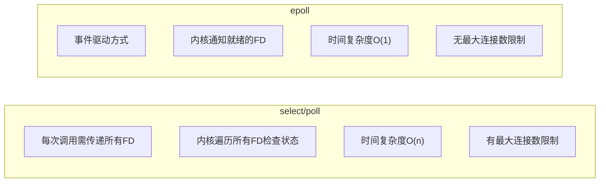

## epoll的核心数据结构

### eventpoll结构体

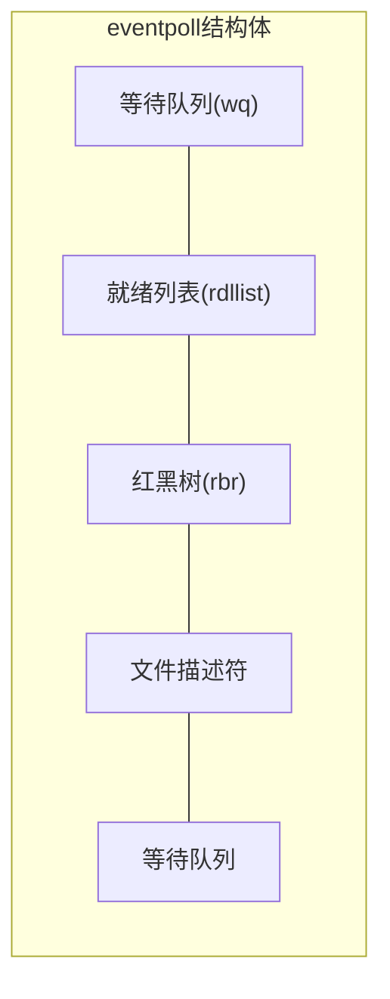

### 红黑树与就绪列表

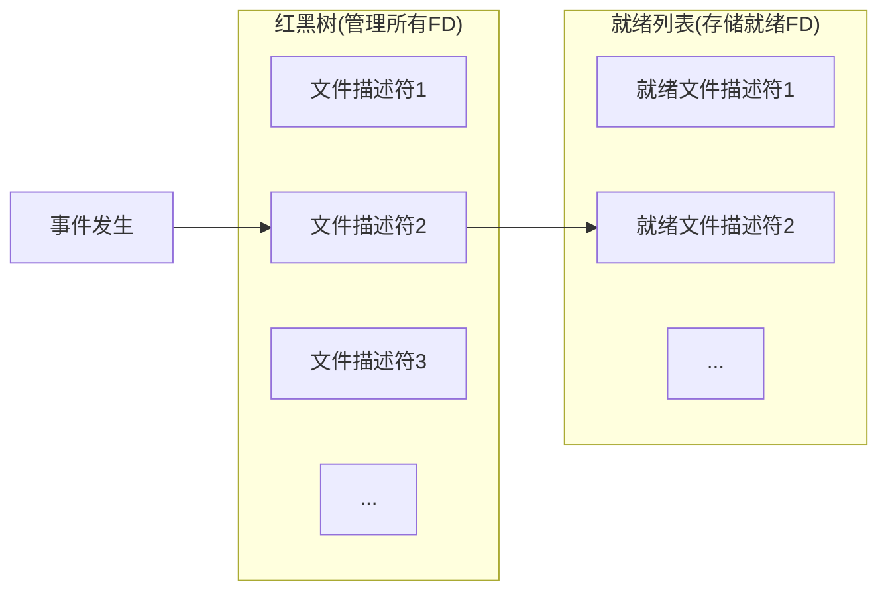

## epoll的工作流程

### 三个主要API

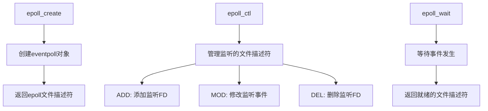

### 详细工作流程

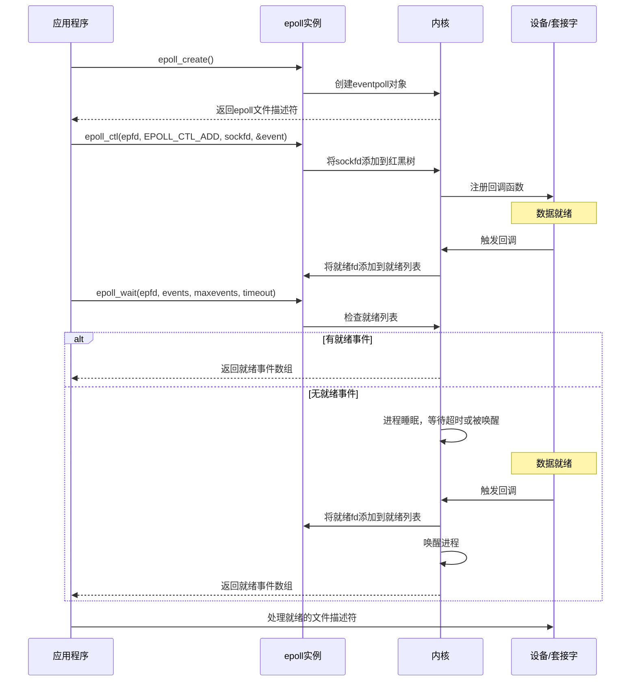

## 触发模式

### 水平触发(LT)与边缘触发(ET)

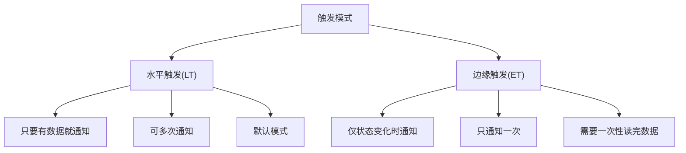

### 两种模式的对比

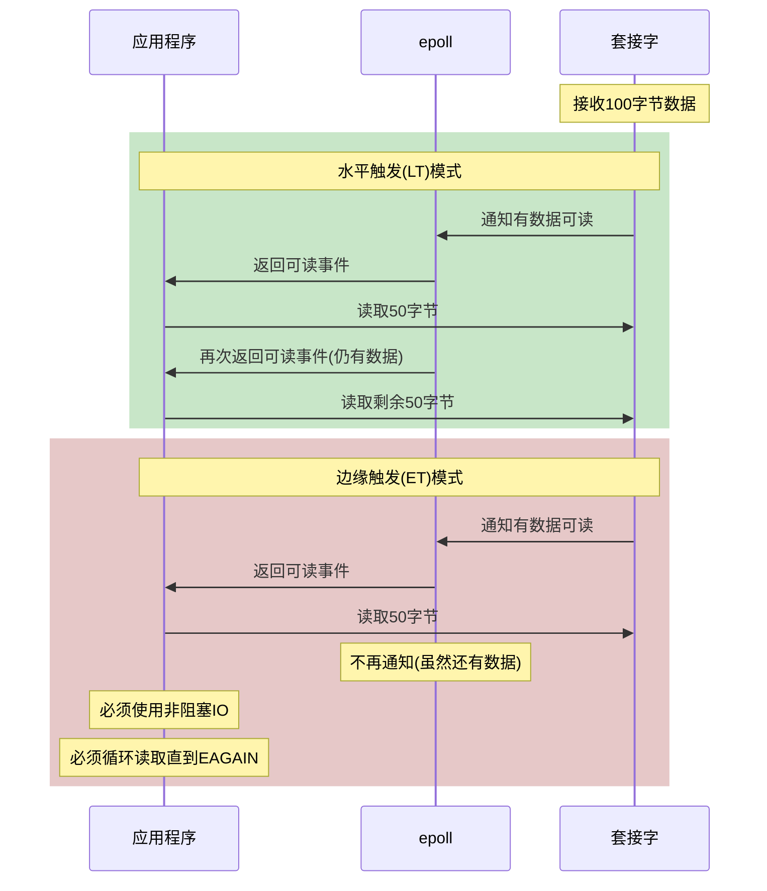

## epoll的实现原理

### 回调机制


### 数据结构关系

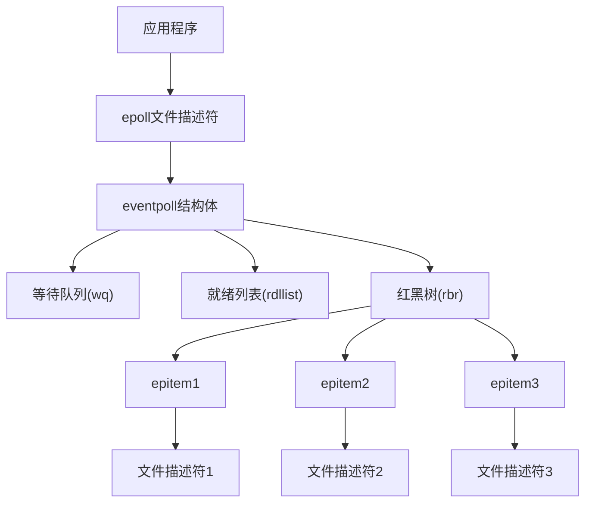

## epoll的性能优化

### 避免重复拷贝

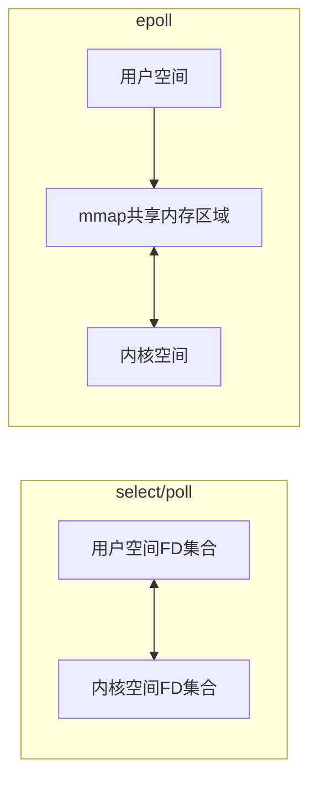

### 就绪通知机制

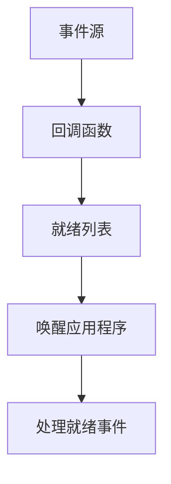

## epoll的应用场景

### 高性能网络服务器

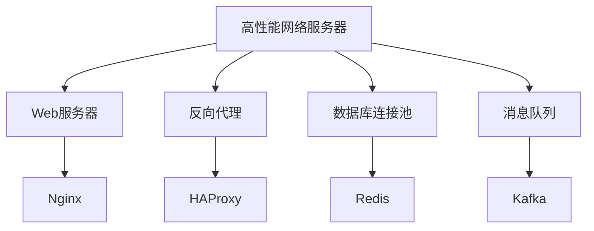

### Reactor模式实现

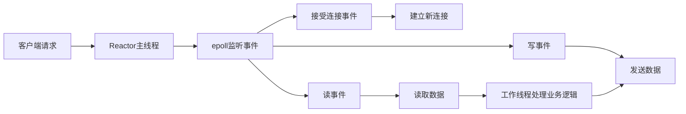

## epoll的最佳实践

### 使用建议

1. **使用ET模式提高性能**：边缘触发模式减少重复通知
2. **搭配非阻塞IO**：特别是在ET模式下，防止阻塞
3. **合理设置timeout**：根据应用需求设置等待超时
4. **避免惊群效应**：多进程/线程使用epoll时注意资源竞争

### 常见陷阱

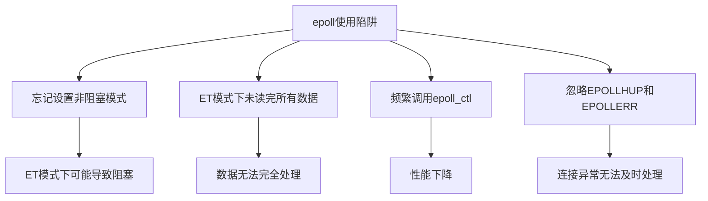

## 总结

epoll通过事件驱动机制、红黑树管理文件描述符、就绪列表存储就绪事件等设计，实现了高效的I/O多路复用。其O(1)的时间复杂度和对大量连接的良好支持，使其成为Linux平台上开发高性能网络服务器的首选技术。理解epoll的实现原理和最佳实践，对于开发高并发、高性能的网络应用至关重要。